<div id="main" class="col-md-9" role="main">

# S1\_probability: Definitions and exercises

<div class="section level2">

## Learning objectives

-   Gain familiarity with concepts of simulation in R using sampling
    from specified sets (e.g., a deck of cards) and using random number
    generation
    -   understand the use of `sample()`
    -   understand how to use `set.seed()` to control the behavior of
        random number generation
-   Estimate event probabilities for specified experimental setups
    -   distinguish the sample size of an experiment and the replication
        size of a simulation
-   Explain the relationship between precision of a probability estimate
    and the sample size of the associated experiment
-   Define and use probability mass functions for discrete outcomes
    -   for binomially distributed outcomes
    -   for outcomes governed by the Poisson and Negative Binomial
        models
    -   in general
-   Understand how to simulate data under null (e.g., fair deck) and
    alternative (e.g., biased deck) conditions
-   Understand the difference between finite, countably infinite, and
    uncountably infinite sample spaces
-   Define and use probability density functions and cumulative
    distribution functions for continuous outcomes
-   Develop some basic concepts of multivariate probability
    distributions
    -   joint probability distribution for two random quantities
    -   contours of a bivariate density: empirical and model-based
    -   covariance and correlation

</div>

<div class="section level2">

## Overview

Our concept of probability is that of “long run relative frequency”.

We’ll work with several models of random events to make this more
concrete.

</div>

<div class="section level2">

## The probability of a 0-1 (binary or dichotomous) event

<div class="section level3">

### Simulating shuffled playing cards

<div class="section level4">

#### Random permutations with `sample()`

We’ll take for granted that `sample(x, size=length(x), replace=FALSE)`
in R achieves a goal of “shuffling” elements of `x`. Thus we assume
that, if `x` is a vector in R, and

    s1 = sample(x, size=length(x), replace=FALSE)
    s2 = sample(x, size=length(x), replace=FALSE)

then no aspect of the ordering of elements in `s1` can be used to
predict anything about the ordering of elements of `s2`.

In other words, `sample(x, size, replace=FALSE)` is taken as a primitive
operation that permutes the elements of `x` in a “random” way.

<div id="cb2" class="sourceCode">

``` r
set.seed(5432) # initialize, for reproducibility, the random number generator
sample(1:5, replace=FALSE) # permute (1,2,3,4,5)
```

</div>

    ## [1] 4 2 1 3 5

<div id="cb4" class="sourceCode">

``` r
sample(1:5, replace=FALSE) # a new, unpredictable, permutation
```

</div>

    ## [1] 3 4 1 2 5

<div class="section level5">

##### Exercises

**1: Why is the second permutation produced above termed
“unpredictable”?**

**2: Predict the outcome of `sample(1:5, replace=FALSE)`, run just after
the one shown above.**

</div>

</div>

<div class="section level4">

#### Card deck definitions and operations

Our card deck is a vector with 52 elements. Unicode characters encode
the “suits”.

If you have not already installed CSHstats (or did so a long time ago)
use

    BiocManager::install("vjcitn/CSHstats")  # install.packages("BiocManager") if necessary

to get access to the software needed to do the computations in this
document.

<div id="cb7" class="sourceCode">

``` r
library(CSHstats)
d = build_deck()
d
```

</div>

    ##  [1] "2 ♡"  "3 ♡"  "4 ♡"  "5 ♡"  "6 ♡"  "7 ♡"  "8 ♡"  "9 ♡"  "10 ♡" "J ♡" 
    ## [11] "Q ♡"  "K ♡"  "A ♡"  "2 ♢"  "3 ♢"  "4 ♢"  "5 ♢"  "6 ♢"  "7 ♢"  "8 ♢" 
    ## [21] "9 ♢"  "10 ♢" "J ♢"  "Q ♢"  "K ♢"  "A ♢"  "2 ♣"  "3 ♣"  "4 ♣"  "5 ♣" 
    ## [31] "6 ♣"  "7 ♣"  "8 ♣"  "9 ♣"  "10 ♣" "J ♣"  "Q ♣"  "K ♣"  "A ♣"  "2 ♤" 
    ## [41] "3 ♤"  "4 ♤"  "5 ♤"  "6 ♤"  "7 ♤"  "8 ♤"  "9 ♤"  "10 ♤" "J ♤"  "Q ♤" 
    ## [51] "K ♤"  "A ♤"

<div id="cb9" class="sourceCode">

``` r
unique(suits(d))
```

</div>

    ## [1] "♡" "♢" "♣" "♤"

<div id="cb11" class="sourceCode">

``` r
unique(faces(d))
```

</div>

    ##  [1] "2"  "3"  "4"  "5"  "6"  "7"  "8"  "9"  "10" "J"  "Q"  "K"  "A"

<div id="cb13" class="sourceCode">

``` r
table(suits(d), faces(d))
```

</div>

    ##    
    ##     10 2 3 4 5 6 7 8 9 A J K Q
    ##   ♡  1 1 1 1 1 1 1 1 1 1 1 1 1
    ##   ♢  1 1 1 1 1 1 1 1 1 1 1 1 1
    ##   ♣  1 1 1 1 1 1 1 1 1 1 1 1 1
    ##   ♤  1 1 1 1 1 1 1 1 1 1 1 1 1

A fair deck has one card for each combination of “face” and “suit”.

<div class="section level5">

##### Exercises

**3: Write the code that produces a new deck that is fair except that it
has two copies of the ten of hearts. Verify that your new deck has this
property.**

</div>

</div>

<div class="section level4">

#### Shuffling the deck

A reproducible shuffling event can be programmed as follows:

<div id="cb15" class="sourceCode">

``` r
set.seed(1234)  # any numeric seed will do but you need to record it
shuffle_deck = function(d) sample(d, size=length(d), replace=FALSE)
head(d)         # top 6 cards
```

</div>

    ## [1] "2 ♡" "3 ♡" "4 ♡" "5 ♡" "6 ♡" "7 ♡"

<div id="cb17" class="sourceCode">

``` r
head(shuffle_deck(d))
```

</div>

    ## [1] "3 ♣"  "4 ♢"  "10 ♢" "Q ♣"  "6 ♤"  "9 ♤"

</div>

<div class="section level4">

#### The top card after a shuffle

<div id="cb19" class="sourceCode">

``` r
set.seed(4141)
top_draw = function(d) shuffle_deck(d)[1]
top_draw(d)
```

</div>

    ## [1] "A ♤"

<div id="cb21" class="sourceCode">

``` r
top_draw(d)
```

</div>

    ## [1] "5 ♤"

<div class="section level5">

##### Exercises

**4: What is the top card in the next shuffle?**

**5: Write code to get the third card.**

**6: What is the probability that the top draw of a shuffled fair deck
is a heart?**

</div>

</div>

</div>

<div class="section level3">

### Estimating the probability of an event

<div class="section level4">

#### A simulation process: repeated shuffles and draws

Here’s a simple way of estimating the probability that the top draw of a
shuffled fair deck is a heart, construed as long run frequency.

We’ll simulate 100 shuffles and save the results of testing the suit of
the top card.

<div id="cb23" class="sourceCode">

``` r
heart_sign = function() "\U2661"  # unicode U2661, prepend backslash
heart_sign()
```

</div>

    ## [1] "♡"

<div id="cb25" class="sourceCode">

``` r
res = rep(NA, 100)
for (i in 1:100) {
 res[i] = (suits(top_draw(d)) == heart_sign()) # TRUE if top card is a heart
}
head(res)
```

</div>

    ## [1] FALSE FALSE  TRUE  TRUE  TRUE FALSE

<div id="cb27" class="sourceCode">

``` r
### relative frequency of the event "suit of top card is 'heart'"
sum(res)/length(res)  
```

</div>

    ## [1] 0.36

A more concise approach with R is:

<div id="cb29" class="sourceCode">

``` r
mean(replicate( 100, suits(top_draw(d)) == heart_sign()) )
```

</div>

    ## [1] 0.22

<div class="section level5">

##### Exercises

**7: How do we interpret the difference between the two probability
estimates given here?**

</div>

</div>

<div class="section level4">

#### Replicating the estimation process

Let’s intensify our investigation with an aim of understanding the
uncertainty of estimation.

We’ll define a variable that gives the size of our “experiment”: we are
shuffling 100 times and we’ll refer to this as the sample size, `SSIZE`

<div id="cb31" class="sourceCode">

``` r
SSIZE = 100
```

</div>

We will study the estimation procedure by replicating the experiment
`N_REPLICATION` times.

<div id="cb32" class="sourceCode">

``` r
N_REPLICATION = 500
```

</div>

<div id="cb33" class="sourceCode">

``` r
set.seed(10101) # initialize, for reproducibility, the random number generator
doubsim = replicate(N_REPLICATION, 
    mean(replicate( SSIZE, suits(top_draw(d)) == heart_sign()) )
    )
```

</div>

<div id="cb34" class="sourceCode">

``` r
hist(doubsim, xlim=c(0,1))
```

</div>

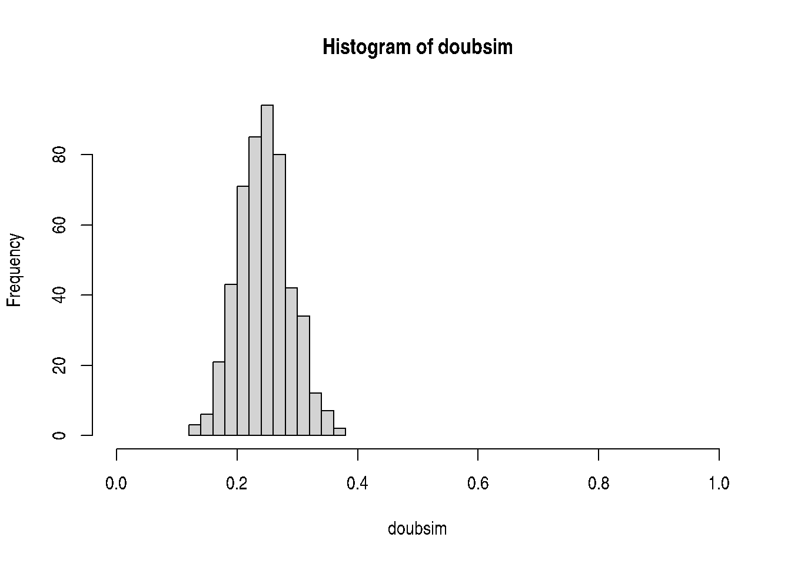

<div class="section level5">

##### Exercises

**8: How can we make the estimate of the probability of the event “suit
of top card is ‘heart’” more precise?**

Answer: increase `SSIZE`.

<div id="cb35" class="sourceCode">

``` r
SSIZE = 500
set.seed(101012)
doubsim2 = replicate(N_REPLICATION, 
    mean(replicate( SSIZE, suits(top_draw(d)) == heart_sign()) )
    )
```

</div>

<div id="cb36" class="sourceCode">

``` r
hist(doubsim2, xlim=c(0,1))
```

</div>

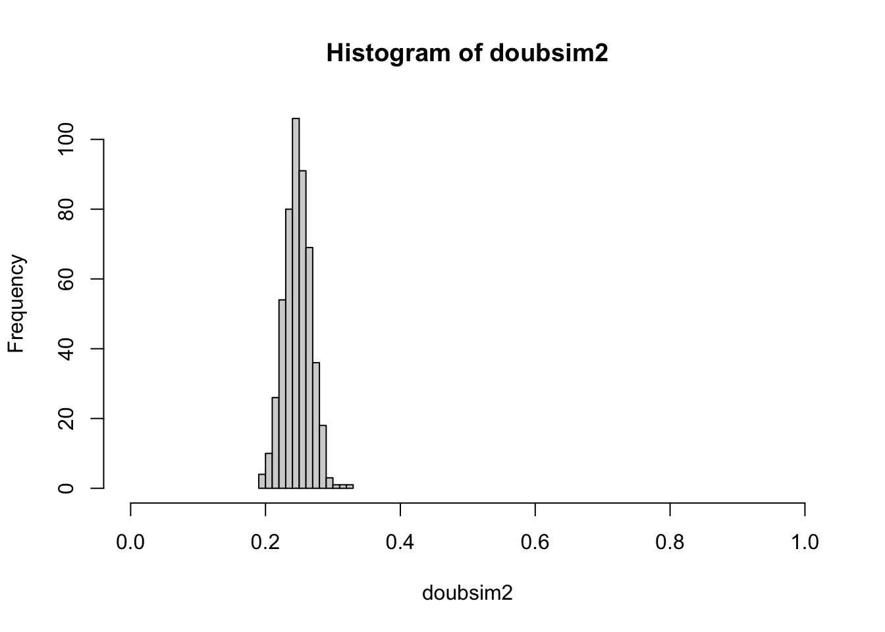

With an increased “sample size”, we have reduced variation in our
experiment-to-experiment estimates of the probability of heart as suit
of top card.

</div>

</div>

</div>

<div class="section level3">

### Formal probability models

Intuitively, the probability of drawing a heart from a well-shuffled
fair deck is 1/4. If we repeat the shuffling and drawing one hundred
times, we expect **around** 25 draws to reveal a heart.

Formal probability models enable us to reason systematically about what
we mean by **around** in our description of our expectation. With these
models we can also create accurate predictions of likely outcomes in
more complex events.

It is useful to define the **sample space** for a probability model,
which is the set of all possible outcomes of the random process being
modeled. For our top-card-drawn example, the sample space is the set of
suits, because we disregard the face value. For the fair deck, each
point in the sample space has probability \\(1/4\\). Events of interest
are “top card is a heart” and “top card is not a heart”. The
probabilities of these events are derivable from the probabilities of
the constituent outcomes.

<div class="section level4">

#### Using the binomial probability model

A series of independent dichotomous events (true or false, zero or one,
heart or non-heart) can be modeled using a **probability mass function**
for the binomial distribution. There are two parameters, \\(p\\) and
\\(n\\), where \\(p\\) is the (unobservable) probability of the event
(say “suit of top card is ‘heart’”) and \\(n\\) is the number of
**independent** trials in which the random dichotomy is observed. In
\\(n\\) “trials”, if the event has probability \\(p\\), the probability
of seeing the event \\(x\\) times is \\\[ Pr(X = x; n, p) =
{\\binom{n}{x}} p^x(1-p)^{n-x} \\\] where have written \\(X\\) to denote
the random quantity and \\(x\\) to denote its realization.

So for a single draw, with \\(X\\) the count of hearts seen in the draw,
we have \\\[ Pr(X=0; 1, 1/4) = 1-1/4 = 3/4 \\\] \\\[ Pr(X=1; 1, 1/4) =
1/4 \\\]

<div class="section level5">

##### Exercises

**9: Modify the production of `doubsim2` so that the \\(x\\)-axis for
the histogram has units “number of times the top card is a heart”.**

<div id="cb37" class="sourceCode">

``` r
hist(doubsim3, xlim=c(.15*500,.35*500), xlab="count of draws with heart as suit of top card")
```

</div>

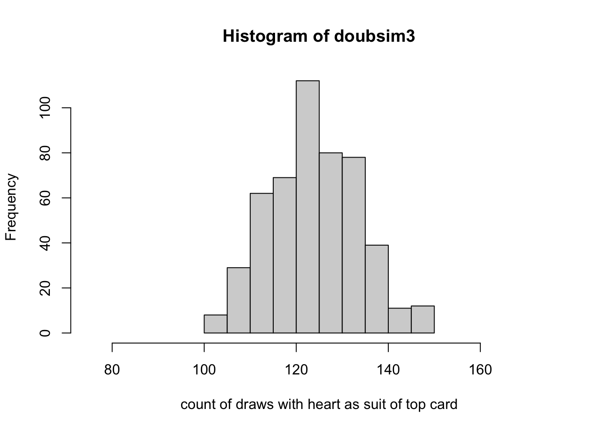

</div>

</div>

<div class="section level4">

#### Visualizing the model and the data

The formula given above tells us how frequently we will observe a given
count. The R function `dbinom` can compute the probability, which we
multiply by the number of realizations to get the height of the
histogram.

<div id="cb38" class="sourceCode">

``` r
hist(doubsim3, xlim=c(.15*500,.35*500), 
   xlab="count of draws with heart as suit of top card", ylim=c(0,115))
points(80:160, 2500*dbinom(80:160, 500, 13/52), pch=19, cex=.5)
legend(78, 110, pch=19, legend="scaled dbinom(x, 500, .25)", bty="n", cex=.85)
```

</div>

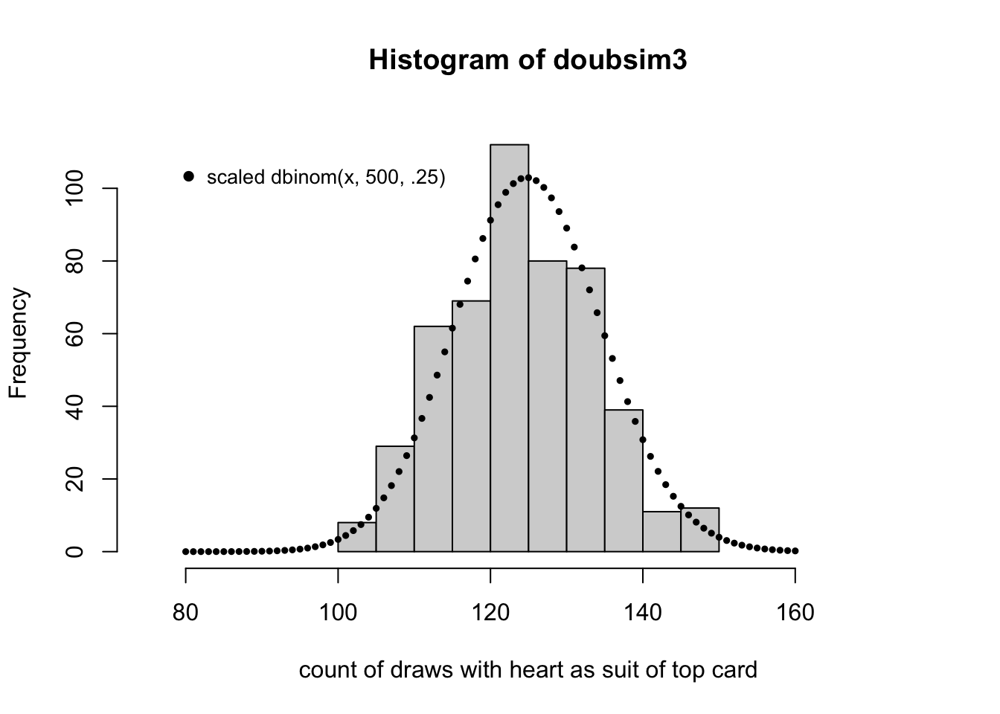

Notice that the histogram, by virtue of its binning of the counts, does
not seem to reflect the shape of the theoretical frequency function
given by the dots. This can be remedied by increasing the number of
replicates used.

There is considerable research regarding the design of histogram
displays. See `?nclass.Sturges` for references. One unpleasant feature
of the display for doubsim2 is that it seems to imply an asymmetric
distribution. Another is the way it “cuts off” at the extremes.

<div class="section level5">

##### Exercises

**10: Write a couple of sentences carefully distinguishing the displays
of doubsim2 and doubsim3 above. Explain the choice of the heuristic name
“doubsim”.**

</div>

</div>

</div>

<div class="section level3">

### A biased deck

Recall the layout of the fair deck:

<div id="cb39" class="sourceCode">

``` r
table(suits(d), faces(d))
```

</div>

    ##    
    ##     10 2 3 4 5 6 7 8 9 A J K Q
    ##   ♡  1 1 1 1 1 1 1 1 1 1 1 1 1
    ##   ♢  1 1 1 1 1 1 1 1 1 1 1 1 1
    ##   ♣  1 1 1 1 1 1 1 1 1 1 1 1 1
    ##   ♤  1 1 1 1 1 1 1 1 1 1 1 1 1

We will make a copy of one card and remove one:

<div id="cb41" class="sourceCode">

``` r
bd = d
bd[18] = bd[3]
table(suits(bd), faces(bd))
```

</div>

    ##    
    ##     10 2 3 4 5 6 7 8 9 A J K Q
    ##   ♡  1 1 1 2 1 1 1 1 1 1 1 1 1
    ##   ♢  1 1 1 1 1 0 1 1 1 1 1 1 1
    ##   ♣  1 1 1 1 1 1 1 1 1 1 1 1 1
    ##   ♤  1 1 1 1 1 1 1 1 1 1 1 1 1

<div class="section level4">

#### Exercises

**11: What is the probability that the top card drawn after a shuffle of
`bd` is a heart?**

**12: What is the probability that the top card drawn after a shuffle of
`bd` is a club?**

</div>

</div>

</div>

<div class="section level2">

## Probability models for categorical outcomes

Thus far we have focused on the dichotomy: top draw is heart or not. We
can consider all the possible suits as a 4-valued response.

<div class="section level3">

### A contingency table

Let’s simulate the process of drawing the top card after shuffling, and
tabulate the suits observed.

<div id="cb43" class="sourceCode">

``` r
set.seed(4321)
table( tops <- replicate(500, suits(top_draw(bd))) )
```

</div>

    ## 
    ##   ♡   ♢   ♣   ♤ 
    ## 148 106 126 120

<div class="section level4">

#### Exercises

**13: What would you expect for the counts for suits in the table above
if the deck were fair?**

</div>

</div>

<div class="section level3">

### Multinomial model and simulation

We adopted the binomial model for the number of top draws with suit
“heart” in a fixed number of shuffles:

\\\[ Pr(X = x; n, p) = {\\binom{n}{x}} p^x(1-p)^{n-x} \\\]

With the fair deck, we have \\(p= 1/4\\). A generalization to a vector
of responses is the multinomial model. We can use this for the (ordered)
vector of counts of top draws yielding different suits. For this problem
we have parameters \\(N\\) (number of trials), \\(k\\) (number of
categories), and \\(p\_1, \\ldots, p\_k\\), the category-specific
probabilities. The realizations are denoted \\(x\_1, \\ldots, x\_k\\)
and we have \\(\\sum\_i x\_i = N\\).

Now the probability model is defined in terms of random vectors and
vectors of probabilities:

\\\[ Pr(X\_1 = x\_1, \\ldots, X\_k = x\_k) = \\frac{n!}{x\_1! \\cdots
x\_k!} p\_1^{x\_1} \\cdots p\_k^{x\_k} \\\]

This provides a more elegant way of producing frequency distributions of
the suit of the top draw. Here we introduce pseudorandom number
generation from the multinomial model, using `rmultinom`.

<div id="cb45" class="sourceCode">

``` r
NREP = 10000
SSIZE = 500
mnmat = rmultinom(NREP, SSIZE, rep(.25,4))
rownames(mnmat) = c("\U2661", "\U2662", "\U2663", "\U2664")
mnmat[,1]  # one draw
```

</div>

    ##   ♡   ♢   ♣   ♤ 
    ## 131 125 110 134

<div id="cb47" class="sourceCode">

``` r
apply(mnmat,1,mean)
```

</div>

    ##        ♡        ♢        ♣        ♤ 
    ## 124.9621 124.9080 125.0362 125.0937

Notice that we did not use the deck `d` in producing this matrix of
counts. Previously we applied `sample()` to the 52-vector of cards. Now
we use the model to develop the data of interest.

<div class="section level4">

#### Exercise

**14: Modify the call to `rmultinom` to obtain distributions of top card
suits for the biased deck `bd`.  
Hint: Change the part of the call involving `rep()`.**

</div>

</div>

<div class="section level3">

### The Poisson distribution

<div class="section level4">

#### Modeling collections of counts

Outcomes taking the form of integer counts arise in many appications. As
an example, a quarry floor is divided into squares about one meter on
the side. 30 squares were searched for a fossil and the number of
specimens per square is recorded. No square had 5 or more specimens.
(Example from *Probability Models and Applications*, I. Olkin, L.
Gleser, C. Derman, ch 6.3.)

The table below includes `nspec`, the number of specimens in a square,
`freq`, the number of squares having the corresponding number of
specimens, and `pred`, a predicted number of specimens based on the
Poisson model with mean parameter 0.73 specimens per square.

<div id="cb49" class="sourceCode">

``` r
foss = data.frame(nspec=0:4, freq=c(16,9,3,1,1), pred=round(30*dpois(0:4, 0.73), 2))
foss
```

</div>

    ##   nspec freq  pred
    ## 1     0   16 14.46
    ## 2     1    9 10.55
    ## 3     2    3  3.85
    ## 4     3    1  0.94
    ## 5     4    1  0.17

To derive the quantities `pred`, we used `dpois` for the counts per
square, with mean parameter set at 0.73. To derive this, we use

<div id="cb51" class="sourceCode">

``` r
sum(foss$nspec * foss$freq)/30
```

</div>

    ## [1] 0.7333333

to obtain the average number of fossils per square. The Poisson model
with mean \\(\\lambda\\) is \\\[ Pr(X = k; \\lambda) =
\\frac{e^{-\\lambda}\\lambda^k}{k!} \\\]

</div>

<div class="section level4">

#### Exercise

**15: Use the formula above to explain the prediction of 14.46 squares
with zero fossils.**

</div>

<div class="section level4">

#### A countably infinite sample space

The binomial and multinomial models discussed above have finite discrete
sample spaces. The sample space for the Poisson model is the set of
non-negative integers. The mass function arises from the fact that
\\(e^\\lambda = \\sum \\lambda^k/k!\\), the sum taken over all
non-negative integers.

</div>

</div>

<div class="section level3">

### The negative binomial model

The mass function is \\\[ p(x; \\theta, \\mu) = \\frac{\\Gamma(\\theta +
x)}{\\Gamma(\\theta)y!} \\frac{\\mu^y \\theta^\\theta}{(\\mu +
\\theta)^{\\theta + y}} \\\]

This will be useful for later material.

</div>

<div class="section level3">

### Mean, variance

The sample mean for the vector \\(x = (x\_1, \\ldots, x\_n)\\) is
defined as \\(\\bar{x} = n^{-1}\\sum\_i x\_i\\). The (unbiased estimator
of the) sample variance is \\((n-1)^{-1}\\sum\_i (x\_i - \\bar{x})^2\\).

We will sometimes refer to mean and variance in the context of
probability models rather than samples. The mean for a continuous
distribution is defined as

For a discrete distribution with probability mass function \\(p\\) the
mean is

\\\[ E(x) = \\sum x p(x), \\\] The sum here is taken over the sample
space for the associated model.

Writing \\(\\mu\\) for the mean value of the distribution under study,
the variance of a discrete distribution is \\\[ V(x) = \\sum (x-\\mu)^2
p(x) dx. \\\]

</div>

</div>

<div class="section level2">

## Models for continuous outcomes

The models we’ve considered thus far are for discrete responses – the
sample space is either finite or countably infinite.

For continuous responses, the sample space is uncountably infinite. The
sample space may be an interval of the real line, or the whole real
line. We will discuss how to define probabilities for subsets of the
sample space.

<div class="section level3">

### Univariate response

For concreteness, we will use RNA-seq data derived from The Cancer
Genome Atlas. We’ll focus on 79 values of normalized RSEM-based
estimates of expression of YY1 in adrenocortical carcinoma.

<div id="cb53" class="sourceCode">

``` r
data(yy1_ex)
head(yy1_ex)
```

</div>

    ## TCGA-OR-A5J1-01A-11R-A29S-07 TCGA-OR-A5J2-01A-11R-A29S-07 
    ##                    1455.8117                    1688.6318 
    ## TCGA-OR-A5J3-01A-11R-A29S-07 TCGA-OR-A5J5-01A-11R-A29S-07 
    ##                    1821.3598                    1877.6143 
    ## TCGA-OR-A5J6-01A-31R-A29S-07 TCGA-OR-A5J7-01A-11R-A29S-07 
    ##                     634.3023                    1132.3706

We will refer to this as a vector of “real valued” outcomes.

<div class="section level4">

#### Cumulative distribution function; quantiles

We’ll use capital letters to denote random variables. The formal
definition of “random variable” is given in textbooks; we will use the
term informally to refer to quantities we regard as random.

The function \\(F(x) = \\mbox{Pr}(X &lt; x)\\) is called the cumulative
distribution function (CDF) for the random variable \\(X\\). For the YY1
measures, we can produce a visualization of the associated CDF:

<div id="cb55" class="sourceCode">

``` r
plot(ecdf(yy1_ex))
abline(h=.8, lty=2)
arrows(1583, .8, 1583, 0, lty=2)
```

</div>

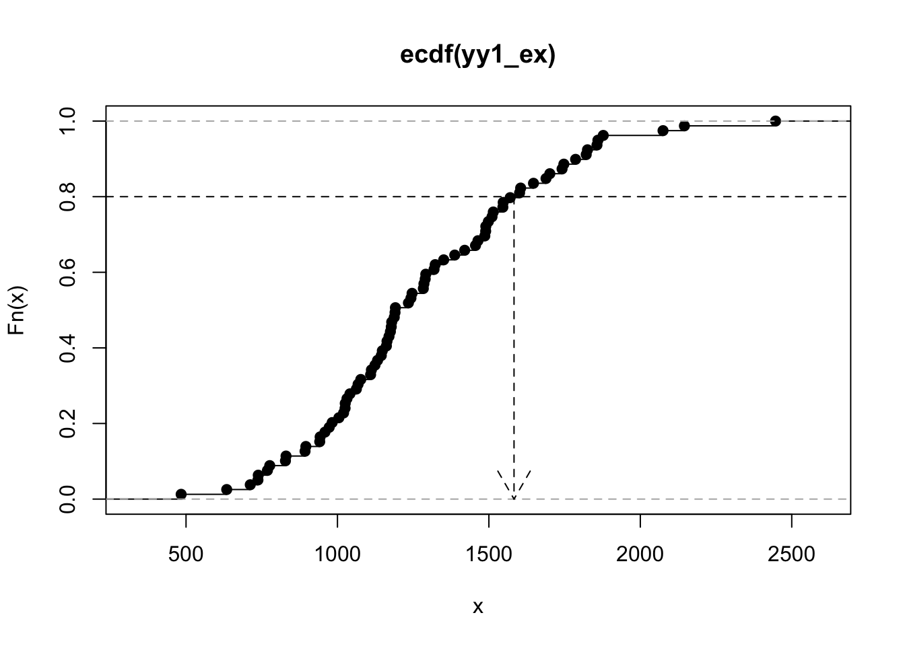

The quantiles of a distribution are given by the inverse of the CDF. The
quantile function takes a number \\(p\\) between 0 and 1 and returns the
number \\(F^{-1}(p)\\).

The graph above shows that the 0.80 quantile of the distribution of our
YY1 vector is about 1584.

</div>

<div class="section level4">

#### Exercise

**16: Show that the proportion of YY1 observations exceeding 1584 is
approximately 20%.**

</div>

<div class="section level4">

#### Histogram, probability density function

The histogram is a tunable display of the relative frequencies of values
in a vector.

<div id="cb56" class="sourceCode">

``` r
par(mfrow=c(2,1), mar=c(4,3,1,1))
hist(yy1_ex, xlim=c(400, 2600))
hist(yy1_ex, breaks=20, xlim=c(400, 2600))
```

</div>

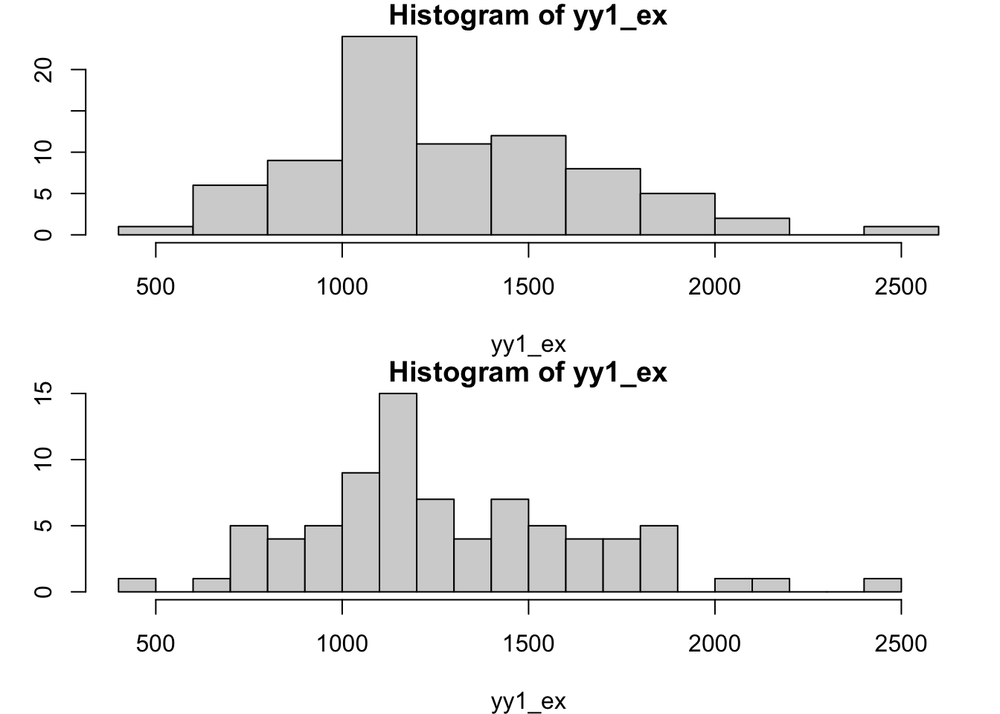

The probability density function for a continuous random variable
\\(X\\) satisfies

\\\[ \\int\_a^b f(x) dx = \\mbox{Pr}(a &lt; X &lt; b) \\\]

We can estimate the density function for a sample in various ways. Here
is a simple illustration:

<div id="cb57" class="sourceCode">

``` r
plot(dd <- density(yy1_ex))
```

</div>

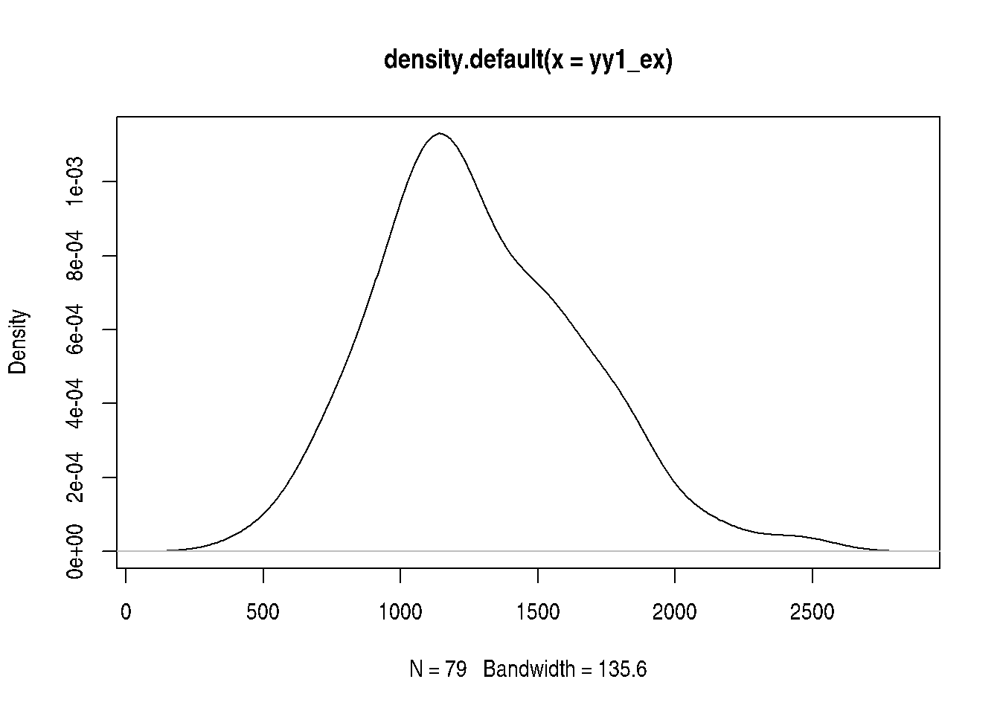

It is of some interest to use `approxfun` and numerical integration with
the density estimate given above, to estimate the probability that YY1
expression lies in a given interval.

<div id="cb58" class="sourceCode">

``` r
dfun = approxfun(dd$x, dd$y)
integrate(dfun, 1000, 1500)  # density-based
```

</div>

    ## 0.481747 with absolute error < 1e-05

<div id="cb60" class="sourceCode">

``` r
mean(yy1_ex >=1000 & yy1_ex <= 1500) # empirical
```

</div>

    ## [1] 0.5316456

Is this acceptable? Could changing the bandwidth for the density
estimator produce better results? Is there a potential overfitting
problem?

</div>

<div class="section level4">

#### Some widely used models for continuous responses

We’ll use simulation to illustrate the shapes of various distributions.
R makes this very simple with a family of functions whose names begin
with `r`.

<div class="section level5">

##### Uniform distribution on \[0,1\]

The density function is \\(f(x) = 1\\) if \\(x \\in \[0,1\]\\) and 0
otherwise.

<div id="cb62" class="sourceCode">

``` r
hist(runif(10000, 0, 1), prob=TRUE)
```

</div>

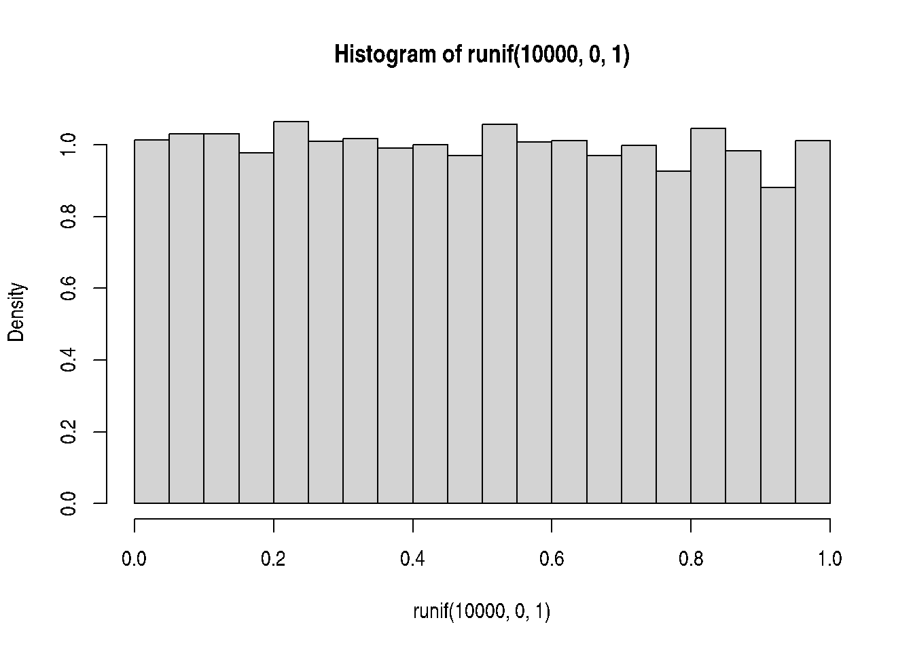

<div class="section level6">

###### Exercise

**17: Use code like that above to obtain the value of the density of a
random variable with uniform density on the interval \[0, 2\].**

</div>

</div>

<div class="section level5">

##### Gaussian model

The Gaussian distribution is also called “normal”. Its shape and
position on the real line are determined by its mean and variance.
Symbolically, the model is often written \\(N(\\mu, \\sigma^2)\\), and
the density function is \\(f(x) = 1/\\sqrt{2\\pi \\sigma^2}
\\exp\\{(x-\\mu)^2/2 \\sigma^2\\}\\).

<div id="cb63" class="sourceCode">

``` r
hist(rnorm(10000, 0, 1), prob=TRUE)
lines(seq(-4,4,len=100), dnorm(seq(-4,4,len=100)))
```

</div>

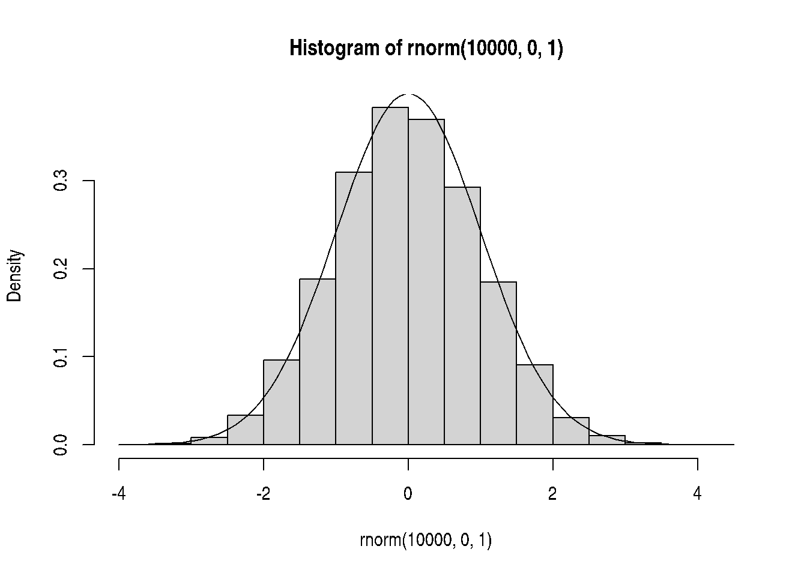

</div>

<div class="section level5">

##### Exponential and Gamma models for survival data

The exponential model (not to be confused with exponential family
models) is defined for random variables with positive values. An example
is survival times. We’ll use a dataset from the survival package to
illustrate.

<div id="cb64" class="sourceCode">

``` r
library(survival) # use myeloma records from Mayo clinic, remove censored times
md = myeloma$futime[myeloma$death==1 & myeloma$entry == 0]
hist(md, breaks=20, prob=TRUE, ylim=c(0,.001))
mean(md)
```

</div>

    ## [1] 1044.768

<div id="cb66" class="sourceCode">

``` r
ss = seq(0,8000,.1)
lines(ss, dexp(ss, rate=1/mean(md)))
```

</div>

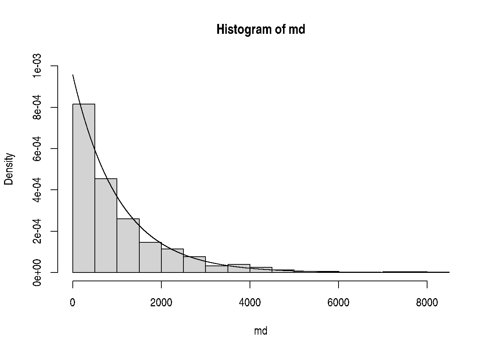

The density function for the exponential model is \\(f(x) = \\lambda e ^
{-\\lambda x}\\). In this formulation, \\(\\lambda\\) is referred to as
the rate parameter. The mean of the distribution is then
\\(1/\\lambda\\).

<div class="section level6">

###### Exercise

**18: How close is the median of the exponential model with rate 1/1045
to the sample median of the myeloma survival times? How does this relate
to the interpretation of the plot above?**

</div>

</div>

</div>

</div>

<div class="section level3">

### Mean and variance for continuous models

For continuous distributions, the mean value is \\\[ E(x) = \\int x f(x)
dx. \\\] Writing \\(\\mu\\) for the mean value of the distribution under
study, the variance of a continuous distribution is \\\[ V(x) = \\int
(x-\\mu)^2 f(x) dx. \\\]

</div>

<div class="section level3">

### Multivariate response

We’ve seen that the use of univariate probability models has many
facets. The concept of *joint distribution* of *multiple* random
quantities is central to reasoning about interactions among components
of complicated processes.

In the following example, we have obtained normalized expression
measures for EGR1 and FOS in adrenocortical carcinoma tumors studied in
TCGA. We’ll use built-in bivariate density estimation to show the
relationship between expression of these two transcription factors in
ACC.

<div id="cb67" class="sourceCode">

``` r
data(fos_ex)
data(egr1_ex)
bivdf = data.frame(fos_ex, egr1_ex)
library(ggplot2)
ggplot(bivdf, aes(x=log(fos_ex), y=log(egr1_ex))) + geom_point() + geom_density_2d()
```

</div>

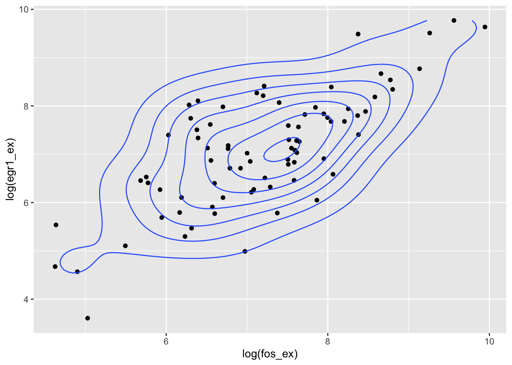

<div class="section level4">

#### Joint cumulative distribution function

We’ll focus on the case of continuous bivariate response denoted
\\((X,Y)\\). The joint cumulative distribution function (cdf) is \\\[
F(x,y) = Pr(X &lt; x, Y &lt; y) \\\] So, for log FOS and log EGR1, we
can evaluate \\(F(7,7)\\) as follows:

<div id="cb68" class="sourceCode">

``` r
mean(log(fos_ex)<7 & log(egr1_ex)<7)
```

</div>

    ## [1] 0.278481

We will call this the empirical estimate of \\(F(7,7)\\).

</div>

<div class="section level4">

#### Covariance matrix, bivariate case

The covariance between two random variables is \\(Cov(X,Y) = EXY -
(EX)(EY)\\); the covariance matrix is symmetric, has the variances on
the diagonal, and the covariance off the diagonal.

<div id="cb70" class="sourceCode">

``` r
var(log(fos_ex)) # univariate
```

</div>

    ## [1] 1.194019

<div id="cb72" class="sourceCode">

``` r
covmat = var(cbind(log(fos_ex), log(egr1_ex))) # matrix
covmat
```

</div>

    ##           [,1]      [,2]
    ## [1,] 1.1940188 0.9746936
    ## [2,] 0.9746936 1.4137188

</div>

<div class="section level4">

#### Using the bivariate normal model

Given estimates of the bivariate mean and covariance, we can use the
multivariate normal cumulative density function to produce contours of
the distribution that will have elliptical shapes, as opposed to the
wiggly contours we saw above.

<div id="cb74" class="sourceCode">

``` r
bmean = c(mean(log(fos_ex)), mean(log(egr1_ex)))
library(mvtnorm)
xgrid = seq(3,10,.05)
ygrid = seq(3,10,.05)
ngrid = length(xgrid)
nd = matrix(NA, ngrid, ngrid)
for (i in 1:ngrid) {  # inefficient!
 for (j in 1:ngrid) {
  nd[i,j] = dmvnorm(c(xgrid[i],ygrid[j]), bmean, covmat)
  }
 }
contour(xgrid, ygrid, nd, ylab="log EGR1", xlab="log FOS")
points(log(fos_ex), log(egr1_ex), col="gray", pch=19)
```

</div>

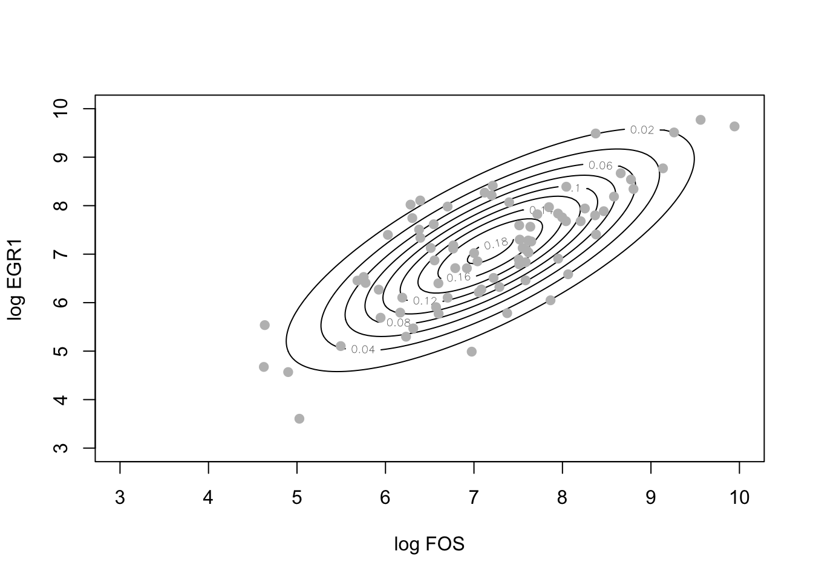

The estimate of \\(F(7,7)\\) using this model is

<div id="cb75" class="sourceCode">

``` r
pmvnorm(upper=c(7,7), mean=bmean, sigma=covmat)
```

</div>

    ## [1] 0.3368775
    ## attr(,"error")
    ## [1] 1e-15
    ## attr(,"msg")
    ## [1] "Normal Completion"

We’ll call this the model-based estimate of \\(F(7,7)\\).

<div class="section level5">

##### Exercise

**19: Obtain empirical and model-based estimates of \\(F(6,5)\\) for
(log FOS, log EGR1).**

</div>

</div>

<div class="section level4">

#### Probabilistic independence and dependence

The “tilted contour ellipses” shown just above indicate that knowledge
of the value of log FOS tells us about variation in values of log EGR1.
If log FOS is 6, the value of log EGR1 is much more likely to be around
6 than it is to be around 9. We use the concept of conditional
distribution to address this concept, and denote this conditional
distribution function \\(F(x\|y)\\), with the vertical bar denoting
conditioning. Specifically, \\(F(x\|Y=y)\\) = Pr(\\(X&lt;x\\)) **given
that** \\(Y = y\\).

Probabilistic independence of two random quantities can be formulated as
the condition that \\(F(x\|y) = F(x)\\): knowledge of the value of
\\(Y\\) provides no information on the distribution of \\(X\\).

</div>

<div class="section level4">

#### Measures of correlation

The correlation coefficient for two random quantities is the ratio of
their covariance to the square root of the product of their variances.

**20: Use the elements of covmat computed above to produce an estimate
of the correlation between log FOS and log EGR1, and compare to cor() in
R for (log FOS, log EGR1).**

</div>

</div>

</div>

</div>
