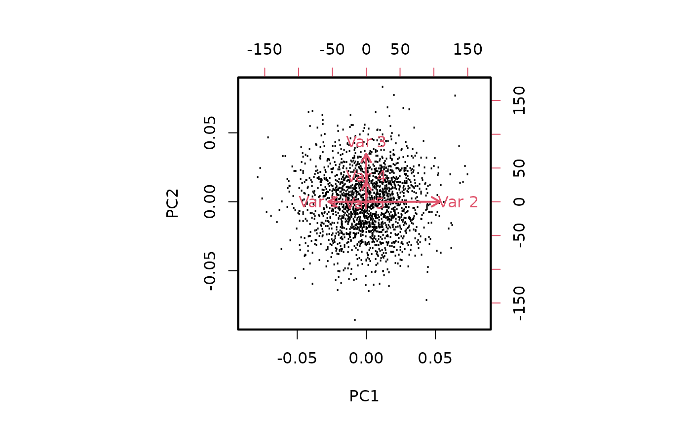

<div id="main" class="col-md-9" role="main">

# S2a: Elements of PCA

<div class="section level2">

## Overview

This vignette explores basic aspects of PCA in bivariate and
5-dimensional data. It concludes with some remarks about “eigengenes”,
which can be verified using the computations shown in the simpler cases.

</div>

<div class="section level2">

## Make a bivariate dataset with positive correlation and heterogeneous variance

First we create a covariance matrix with greater variance for second
variable of our pair.

<div id="cb1" class="sourceCode">

``` r
library(MASS)
set.seed(1234)
options(digits=3)
cm = matrix(c(1,1,1,4), nr=2)
cm
```

</div>

    ##      [,1] [,2]
    ## [1,]    1    1
    ## [2,]    1    4

Then we generate a 20000 x 2 matrix of bivariate normal deviates.

<div id="cb3" class="sourceCode">

``` r
sim1 = mvrnorm(20000, c(0,0), cm)
cov(sim1)
```

</div>

    ##       [,1]  [,2]
    ## [1,] 1.002 0.995
    ## [2,] 0.995 3.973

<div id="cb5" class="sourceCode">

``` r
cor(sim1)
```

</div>

    ##       [,1]  [,2]
    ## [1,] 1.000 0.499
    ## [2,] 0.499 1.000

The data in the original units is easy to visualize:

<div id="cb7" class="sourceCode">

``` r
plot(sim1,xlim=c(-10,10), ylim=c(-10,10))
```

</div>


Now we will perform a PCA. We don’t have to reduce dimensions, but we
can get a handle on how the components are formed and interpreted.

<div id="cb8" class="sourceCode">

``` r
prc = prcomp(sim1, center=FALSE)
plot(prc$x, xlim=c(-10,10), ylim=c(-10,10))
```

</div>


PC1 is produced by taking *linear combinations* of the rows of sim1.

We’ll illustrate the linear combination concept. The data vector for the
first row may be written \\((x\_1, x\_2)\\), and a linear combination
has the form \\(ax\_1 + bx\_2\\) for some coefficients \\(a\\) and
\\(b\\).

The coefficients are derived from the rotation component of the PCA.

<div id="cb9" class="sourceCode">

``` r
prc$rotation
```

</div>

    ##        PC1    PC2
    ## [1,] 0.291  0.957
    ## [2,] 0.957 -0.291

<div id="cb11" class="sourceCode">

``` r
c11 = prc$rotation[1,1]
c21 = prc$rotation[2,1]
sim1[1,1]*c11 + sim1[1,2]*c21
```

</div>

    ##  PC1 
    ## -2.5

<div id="cb13" class="sourceCode">

``` r
prc$x[1,1]
```

</div>

    ##  PC1 
    ## -2.5

This can be done wholesale using matrix multiplication `%*%`:

<div id="cb15" class="sourceCode">

``` r
(sim1 %*% prc$rotation)[1:5,]
```

</div>

    ##         PC1    PC2
    ## [1,] -2.502  1.412
    ## [2,]  0.576  0.797
    ## [3,]  2.250  0.539
    ## [4,] -4.866 -0.213
    ## [5,]  0.891  1.017

<div id="cb17" class="sourceCode">

``` r
prc$x[1:5,]
```

</div>

    ##         PC1    PC2
    ## [1,] -2.502  1.412
    ## [2,]  0.576  0.797
    ## [3,]  2.250  0.539
    ## [4,] -4.866 -0.213
    ## [5,]  0.891  1.017

<div id="cb19" class="sourceCode">

``` r
all.equal(prc$x, sim1%*% prc$rotation)
```

</div>

    ## [1] TRUE

Exercises.

-   Recover the value of `prc$x[1,2]` using the second column of
    `prc$rotation`.

-   Examine these plots

<div id="cb21" class="sourceCode">

``` r
par(mfrow=c(2,2), mar=c(4,4,3,1))
plot(sim1, xlim=c(-10,10), ylim=c(-10,10), main="raw data",
  xlab="data column 1", ylab="data col. 2")
plot(sim1 %*% prc$rotation, xlim=c(-10,10), ylim=c(-10,10),
  main="data %*% prc$rotation", xlab="PC1 via rotation",
   ylab="PC2 via rotation")
plot(prc$x, xlim=c(-10,10), ylim=c(-10,10), main="x from prcomp",
    )
plot(sim1 %*% 
 prc$rotation %*% t(prc$rotation), xlim=c(-10,10), ylim=c(-10,10),
  main="data %*% rot %*% t(rot)", xlab="data %*% VVt (col 1)",
  ylab = "data %*% VVt (col 2)")
```

</div>


The rotation has been “undone”. Letting \\(V\\) denote the ‘rotation’
component of the PCA, this shows that the matrix product \\(VV^t = I\\),
where \\(I\\) is a diagonal matrix with 1 on the diagonal. More
background on the underlying computations can be gleaned from the
[Wikipedia entry on singular value
decomposition](https://en.wikipedia.org/wiki/Singular_value_decomposition).

</div>

<div class="section level2">

## A larger covariance matrix

Here we have a 5-dimensional dataset. We set up the covariance matrix so
that columns 1 and 2 have negative correlation, columns 3 and 4 have
positive correlation, column 2 has greatest overall variance, and
columns 1 and 3 have elevated variance.

<div id="cb22" class="sourceCode">

``` r
cm = diag(5)
cm[3,4] = cm[4,3] = .8
cm[1,2] = cm[2,1] = -.6
A = diag(5)
A[1,1] = 2
A[2,2] = 3
A[3,3] = 2
covm = A%*%cm%*%A
myd = mvrnorm(2000, rep(0,5), covm)
```

</div>

The pairs plot shows the data in original units.

<div id="cb23" class="sourceCode">

``` r
pairs(myd, xlim=c(-10,10), ylim=c(-10,10))
```

</div>


We verify the multivariate structure:

<div id="cb24" class="sourceCode">

``` r
cor(myd)
```

</div>

    ##          [,1]     [,2]     [,3]     [,4]    [,5]
    ## [1,]  1.00000 -0.61123 -0.00337  0.01546  0.0489
    ## [2,] -0.61123  1.00000 -0.00105  0.00686 -0.0348
    ## [3,] -0.00337 -0.00105  1.00000  0.80438 -0.0361
    ## [4,]  0.01546  0.00686  0.80438  1.00000 -0.0365
    ## [5,]  0.04888 -0.03478 -0.03611 -0.03648  1.0000

<div id="cb26" class="sourceCode">

``` r
cov(myd)
```

</div>

    ##         [,1]     [,2]     [,3]    [,4]    [,5]
    ## [1,]  4.1482 -3.88159 -0.01360  0.0317  0.0986
    ## [2,] -3.8816  9.72168 -0.00648  0.0215 -0.1075
    ## [3,] -0.0136 -0.00648  3.91911  1.6017 -0.0708
    ## [4,]  0.0317  0.02153  1.60174  1.0118 -0.0364
    ## [5,]  0.0986 -0.10745 -0.07082 -0.0364  0.9816

<div id="cb28" class="sourceCode">

``` r
dim(myd)
```

</div>

    ## [1] 2000    5

Compute PCA

<div id="cb30" class="sourceCode">

``` r
pp = prcomp(myd)
pairs(pp$x)
```

</div>


The biplot shows the projection to PC1-PC2 and shows how the different
variables are related, and how they drive the projection.

<div id="cb31" class="sourceCode">

``` r
par(lwd=2)
biplot(pp, xlabs=rep(".", 2000), expand=.8)
```

</div>



Exercise: Explain the configuration of arrows in the biplot.

</div>

<div class="section level2">

## “Eigengenes” derived from PCA

When the rows are samples and columns are genes, the x components of
prcomp’s output are linear combinations of all genes. The coefficients
of the combination are derived from the PCA rotation matrix, which is
constructed so as to

-   order the PCs so that the components capturing the most variation
    come first
-   construct the PCs so they are mutually orthogonal

Note that the simple reconstructions above have required that prcomp be
used with center=FALSE.

</div>

</div>
