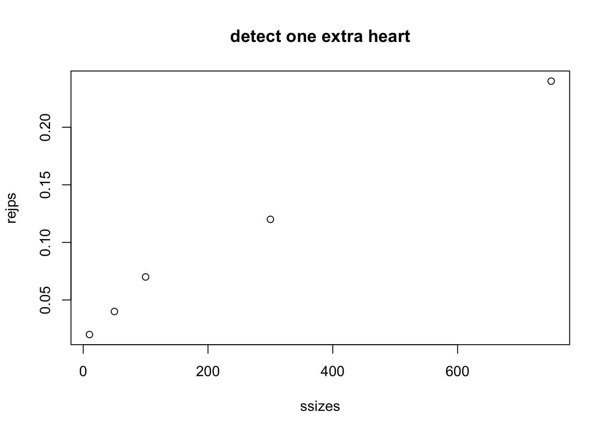
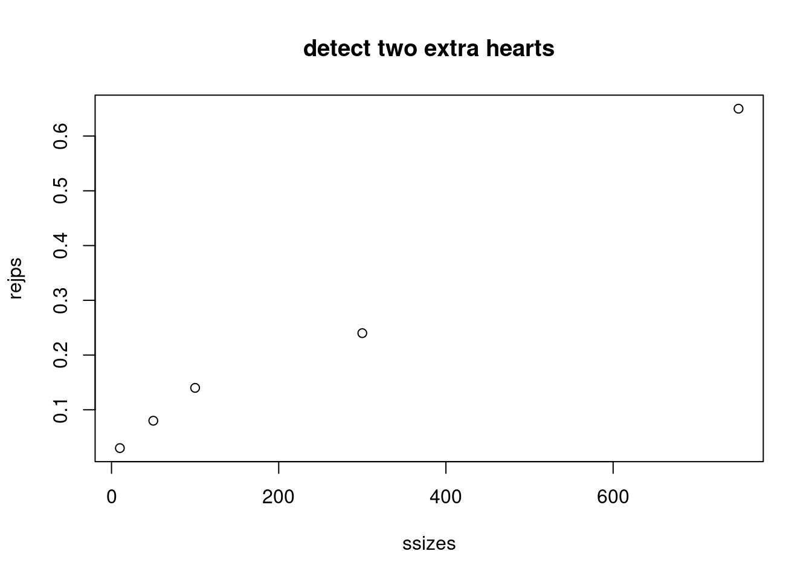
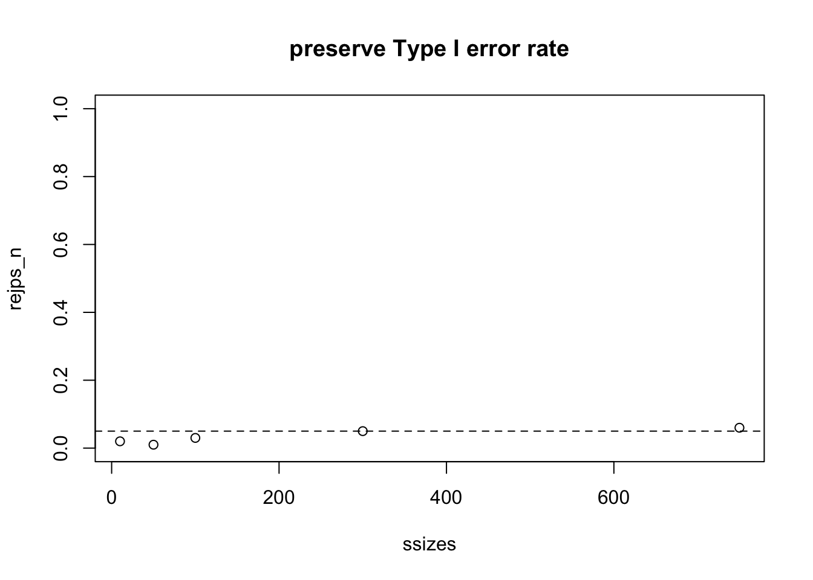

<div id="main" class="col-md-9" role="main">

# S4\_inference: Definitions and exercises

<div class="section level2">

## Inference

<div class="section level3">

### Basic concepts

We are going to focus on the framework known “null hypothesis
significance testing”. A “null hypothesis” is typically denoted
\\(H\_0\\) and expresses a claim that often involves a *lack* of effect
of an experimental intervention on an outcome of interest. An
“alternative hypothesis” is denoted \\(H\_1\\), and it should express a
specific measurable impact of an intervention.

In the case of our card deck from chapter S1, it would be typical to
postulate

-   \\(H\_0\\): deck is fair, one card of each combination of face and
    suit
-   \\(H\_1\\): deck has been tampered with and has an excess of hearts

Note that in this case, \\(H\_1\\) is fairly vague – it could be less
specific, referring only to lack of fairness. \\(H\_1\\) specifies which
suit has an excess representation in the deck, but it is not specific
about how severe the tampering has been.

In experimental design, it is important to have a clear view of

-   *sources of variation* in the outcome of interest, and
-   the *magnitude of effect* of intervention that is scientifically
    important.

Only when both of these are in focus can we establish the *operating
characteristics* of our proposed experiment.

In the significance testing framework, we formalize operating
characteristics as probabilities of inferential error, described below.

Before we plunge in to more formalities, let’s recall how to work with
the deck of cards.

Here we create a fair deck:

<div id="cb1" class="sourceCode">

``` r
library(CSHstats)
d = build_deck()
table(suits(d), faces(d))
```

</div>

    ##    
    ##     10 2 3 4 5 6 7 8 9 A J K Q
    ##   ♡  1 1 1 1 1 1 1 1 1 1 1 1 1
    ##   ♢  1 1 1 1 1 1 1 1 1 1 1 1 1
    ##   ♣  1 1 1 1 1 1 1 1 1 1 1 1 1
    ##   ♤  1 1 1 1 1 1 1 1 1 1 1 1 1

Now let’s create a severely biased deck:

<div id="cb3" class="sourceCode">

``` r
bd = d  # just a copy
bd[18] = bd[3]
bd[19] = bd[3]
bd[20] = bd[4]
bd[21] = bd[5]
table(suits(bd), faces(bd))
```

</div>

    ##    
    ##     10 2 3 4 5 6 7 8 9 A J K Q
    ##   ♡  1 1 1 3 2 2 1 1 1 1 1 1 1
    ##   ♢  1 1 1 1 1 0 0 0 0 1 1 1 1
    ##   ♣  1 1 1 1 1 1 1 1 1 1 1 1 1
    ##   ♤  1 1 1 1 1 1 1 1 1 1 1 1 1

Here are our tools for shuffling and drawing the top card:

<div id="cb5" class="sourceCode">

``` r
shuffle_deck = function(d) sample(d, size=length(d), replace=FALSE)
top_draw = function(d) shuffle_deck(d)[1]
```

</div>

Let’s make a reproducible random draw:

<div id="cb6" class="sourceCode">

``` r
set.seed(1234)
t1 = top_draw(bd)
t1
```

</div>

    ## [1] "3 ♣"

Exercise: create a vector holding 100 draws from the biased deck.
Estimate the probability that the suit of the top card is diamond. Use

<div id="cb8" class="sourceCode">

``` r
diamond_sign = function() "\U2662"
```

</div>

to test the suit of each draw. For example:

<div id="cb9" class="sourceCode">

``` r
t1 == diamond_sign()
```

</div>

    ## [1] FALSE

Note: starting with set.seed(2345), the estimated probability of diamond
as suit of top draw that I found was 0.16.

</div>

<div class="section level3">

### The fairness hypothesis

Let \\(C\_1\\) denote the suit of the top card revealed after a fair
shuffle. We can state a hypothesis about the fairness of the deck under
repeated draws of top card after shuffling as

\\\[ H\_0: Pr(C\_1 = \\heartsuit) = Pr(C\_1 = \\diamondsuit) = Pr(C\_1 =
\\clubsuit) = Pr(C\_1 = \\spadesuit) = 1/4 \\\]

</div>

<div class="section level3">

### Operating characteristics: Type I and Type II errors

In a frequentist framework for statistical inference, we define
procedures for testing (null) hypotheses with specified error
probabilities.

-   A **Type I error** occurs when the null hypothesis is true but the
    test results in the assertion that it is false. Traditionally we try
    to keep the probability of Type I errors below 5%.

-   A **Type II error** occurs when the null hypothesis is false but the
    test does not result in an assertion that it is false. Traditionally
    we try to keep the probability of Type II errors below 20%.

-   Synonyms: We often use **size** as synonymous with Type I error
    probability, and **power** as one minus the Type II error
    probability

<div class="section level4">

#### Exercise

**1: Propose a procedure for testing \\(H\_0: Pr(C\_1 = \\heartsuit) =
1/4\\). Assume you have the results of top card draws from N shuffles.
What would such a procedure look like?**

</div>

</div>

<div class="section level3">

### Simulating a series of experiments; parameter estimate

<div id="cb11" class="sourceCode">

``` r
suppressPackageStartupMessages({
suppressMessages({
library(CSHstats)
library(EnvStats)
})
})
d = build_deck()
shuffle_deck = function(d) sample(d, size=length(d), replace=FALSE)
heart_sign = function() "\U2661"
set.seed(4141)
top_draw = function(d) shuffle_deck(d)[1]
N = 100
mydat = replicate(N, suits(top_draw(d))==heart_sign())
phat = function(dat) sum(dat)/length(dat)
phat(mydat)
```

</div>

    ## [1] 0.35

With 100 shuffles we have an estimate of the probability of a heart. Is
our experimental result consistent with \\(H\_0\\)?

With a larger sample size:

<div id="cb13" class="sourceCode">

``` r
N = 1000
mydat = replicate(N, suits(top_draw(d))==heart_sign())
sum(mydat)/length(mydat)
```

</div>

    ## [1] 0.243

</div>

<div class="section level3">

### An improvised test

Let’s use the procedure `|phat(dat)-.25|>.01` as our criterion for
rejecting \\(H\_0: Pr(C\_1 = \\heartsuit) = 1/4\\) What is the Type I
error rate for a fair deck for the experiment based on 100 shuffles?

<div id="cb15" class="sourceCode">

``` r
N = 100
NSIM = 1000
tsts = replicate(NSIM,
   abs(mean(replicate(N, suits(top_draw(d))==heart_sign()))-.25)>.01)
mean(tsts)
```

</div>

    ## [1] 0.911

Parameterize the “delta”, which was 0.01 in the previous run. Let’s get
the rejection rate estimates for two sample sizes:

<div id="cb17" class="sourceCode">

``` r
prej = function(delta=.01, nullval=.25, NSIM, N) {
 mean(replicate(NSIM,
   abs(mean(replicate(N, suits(top_draw(d))==heart_sign()))-nullval)>delta))
}
prej(delta=.02, NSIM=1000, N=100)
```

</div>

    ## [1] 0.655

<div id="cb19" class="sourceCode">

``` r
prej(delta=.02, NSIM=1000, N=500)
```

</div>

    ## [1] 0.323

Our home-cooked test has a Type I error rate that is much too high for
standard practice, and depends on the sample size.

</div>

<div class="section level3">

### A properly calibrated procedure

Let’s instead use the built in procedure for testing hypotheses with
binomial outcomes.

The `brej` function defined below has two layers: - inner: given N
draws, test that the sum of the number of hearts is consistent with a
specified null value (1/4 by default), with a specified Type I error
rate (argument alpha) - outer: replicate the inner process NSIM times to
obtain NSIM indicator variables taking value 1 if the test rejected and
0 otherwise

We then estimate rejection probabilities by taking the means of the
indicator variables for different experimental and replication setups.

<div id="cb21" class="sourceCode">

``` r
brej = function(deck, nullval=.25, alpha=0.05, NSIM, N) {
 replicate(NSIM, {
   dat = replicate(N, suits(top_draw(deck))==heart_sign())
   binom.test(sum(dat), N, nullval)$p.value < alpha
   })
}
mean(brej(d,NSIM=1000, N=100))
```

</div>

    ## [1] 0.054

<div id="cb23" class="sourceCode">

``` r
mean(brej(d,NSIM=1000, N=500))
```

</div>

    ## [1] 0.06

<div id="cb25" class="sourceCode">

``` r
mean(brej(d,NSIM=1000, N=100, alpha=0.01))
```

</div>

    ## [1] 0.006

We have an indication here that the procedure stabilizes the Type I
error rate for different designs (sample sizes) and can accommodate
different significance levels.

</div>

</div>

<div class="section level2">

## Power curve

It is often useful to sketch the power of a test procedure over a series
of values of an element of the experimental/testing setup. We’ll
consider how the power to reject the null varies with the sample size,
for two alternatives to the null.

We make a biased deck by switching one diamond to a heart. For such a
deck, the probability of a heart is 14/52, greater than 1/4.

<div id="cb27" class="sourceCode">

``` r
bd = d
bd[18] = bd[4]
table(suits(bd), faces(bd))
```

</div>

    ##    
    ##     10 2 3 4 5 6 7 8 9 A J K Q
    ##   ♡  1 1 1 1 2 1 1 1 1 1 1 1 1
    ##   ♢  1 1 1 1 1 0 1 1 1 1 1 1 1
    ##   ♣  1 1 1 1 1 1 1 1 1 1 1 1 1
    ##   ♤  1 1 1 1 1 1 1 1 1 1 1 1 1

What kind of sample size do we need to get good power to detect this
exception?

<div id="cb29" class="sourceCode">

``` r
ssizes = c(10,50, 100, 300,750)
rejps = sapply(ssizes, function(x) mean(brej(bd, NSIM=100, N=x)))
plot(ssizes, rejps, main="detect one extra heart")
```

</div>



With two switches, the probability of a heart increases to 15/52.

<div id="cb30" class="sourceCode">

``` r
bd[19] = bd[5]
table(suits(bd), faces(bd))
```

</div>

    ##    
    ##     10 2 3 4 5 6 7 8 9 A J K Q
    ##   ♡  1 1 1 1 2 2 1 1 1 1 1 1 1
    ##   ♢  1 1 1 1 1 0 0 1 1 1 1 1 1
    ##   ♣  1 1 1 1 1 1 1 1 1 1 1 1 1
    ##   ♤  1 1 1 1 1 1 1 1 1 1 1 1 1

<div id="cb32" class="sourceCode">

``` r
rejps = sapply(ssizes, function(x) mean(brej(bd, NSIM=100, N=x)))
plot(ssizes, rejps, main="detect two extra hearts")
```

</div>



Finally, we show that under the null hypothesis (deck is fair) the
rejection rate is approximately 0.05 for a range of sample sizes.

<div id="cb33" class="sourceCode">

``` r
rejps_n = sapply(ssizes, function(x) mean(brej(d, NSIM=100, N=x)))
plot(ssizes, rejps_n, main="preserve Type I error rate", ylim=c(0,1))
abline(h=0.05, lty=2)
```

</div>



</div>

<div class="section level2">

## Conclusions

-   Classical frequentist inference aims to control probabilities of
    errors of Type I (reject a null hypothesis that is true) and Type II
    (fail to reject a false null). The power of a test procedure is one
    minus its Type II error probability.

-   Typically the null hypothesis specifies the value of a parameter of
    a population distribution

    -   in the case of the card deck, the hypothesis of fairness of deck
        and shuffling procedure entails the probability of drawing a
        heart after a shuffle is 1/4
    -   the experimental setup entails that the probability distribution
        of the sum of the number of hearts drawn as top card under N
        shuffling events is binomial(N,1/4)

-   R’s `binom.test` is given

    -   the sum of the number of hearts observed,
    -   the number of trials,
    -   the parameter value defining the null hypothesis,
    -   the desired type I error rate,

and produces a critical region using the binomial distribution

When the sum falls in the critical region, the null hypothesis is
rejected

-   Verification of achievement of the desired Type I and Type II error
    probabilities for a testing procedure can be pursued via simulation

-   The power curve for a sequence of experimental conditions can be
    produced via simulation

-   Analytical tools for power computation are also available. For
    example, in the EnvStats package, we find

<div id="cb34" class="sourceCode">

``` r
library(EnvStats)
propTestPower(750, p.or.p1=13/52, p0=.25 )
```

</div>

    ## [1] 0.05

<div id="cb36" class="sourceCode">

``` r
propTestPower(750, p.or.p1=14/52, p0=.25 )
```

</div>

    ## [1] 0.2348789

<div id="cb38" class="sourceCode">

``` r
propTestPower(750, p.or.p1=15/52, p0=.25 )
```

</div>

    ## [1] 0.6742566

An exercise is to reconcile these results with the simulation-based
results given above.

Another is to find the sample size needed to achieve 80% power to detect
a single switch from diamond to heart in an otherwise fair deck.

</div>

</div>
