<div id="main" class="col-md-9" role="main">

# S5\_inference: FDR, linear models, and GLMs

<div class="section level2">

## Review of some inference concepts

<div class="section level3">

### Error rates: size and power

-   Null hypothesis testing framework: we typically aim to assess
    whether an intervention affects a parameter value for a certain
    population

    -   does the average value of some quantity change after treatment?
    -   does changing the composition of a deck of cards affect the
        probability of seeing a given suit when drawing a card?

-   Type I error: reject the null when it is actually true

-   Type II error: fail to reject null when it is actually false

</div>

<div class="section level3">

### p-value: a condensation of the data and assumptions

The p-value for a test is the probability of observing the statistic
seen in the experiment **or any more extreme value of the statistic**
given that the null hypothesis is true.

<div id="cb1" class="sourceCode">

``` r
binom.test(27, 100, 1/4)
```

</div>

    ## 
    ##  Exact binomial test
    ## 
    ## data:  27 and 100
    ## number of successes = 27, number of trials = 100, p-value = 0.6446
    ## alternative hypothesis: true probability of success is not equal to 0.25
    ## 95 percent confidence interval:
    ##  0.1860664 0.3680163
    ## sample estimates:
    ## probability of success 
    ##                   0.27

This two-sided p-value is obtained via

<div id="cb3" class="sourceCode">

``` r
sum(dbinom(27:100, 100, .25))+sum(dbinom(1:22,100, .25))
```

</div>

    ## [1] 0.6446304

because all the results of 27 or more hearts seen, or 22 or fewer hearts
seen are “as or more extreme” as what we have observed.

Because the p-value is a probability, its value reflects uncertainty in
our assessment of the relation of the data to null hypothesis. Large
p-values suggest that there is not much reason to use the data to reject
the null hypothesis; small p-values suggest that either the null
hypothesis is false or a very rare event has occurred.

</div>

<div class="section level3">

### Confidence interval: an alternative expression of uncertainty

If we observed 30 hearts in 100 top-card draws, our test report would
be:

<div id="cb5" class="sourceCode">

``` r
binom.test(30, 100, 1/4)
```

</div>

    ## 
    ##  Exact binomial test
    ## 
    ## data:  30 and 100
    ## number of successes = 30, number of trials = 100, p-value = 0.2491
    ## alternative hypothesis: true probability of success is not equal to 0.25
    ## 95 percent confidence interval:
    ##  0.2124064 0.3998147
    ## sample estimates:
    ## probability of success 
    ##                    0.3

The confidence interval is a random interval derived from the data that
has the property that it will include the true value of the population
parameter of interest with a specified probability.

<div id="cb7" class="sourceCode">

``` r
stats = c(27:42)
tests = lapply(stats, function(x) binom.test(x, 100, .25))
low = sapply(tests, function(x) x$conf.int[1])
hi = sapply(tests, function(x) x$conf.int[2])
ests = sapply(tests, "[[", "statistic")
plot(stats, ests, ylim=c(0, .6), main="95% Confidence intervals", xlab="# hearts seen in 100 draws",
  ylab="estimated proportion of hearts")
segments( stats, low, stats, hi)
abline(h=.25, lty=2)
```

</div>

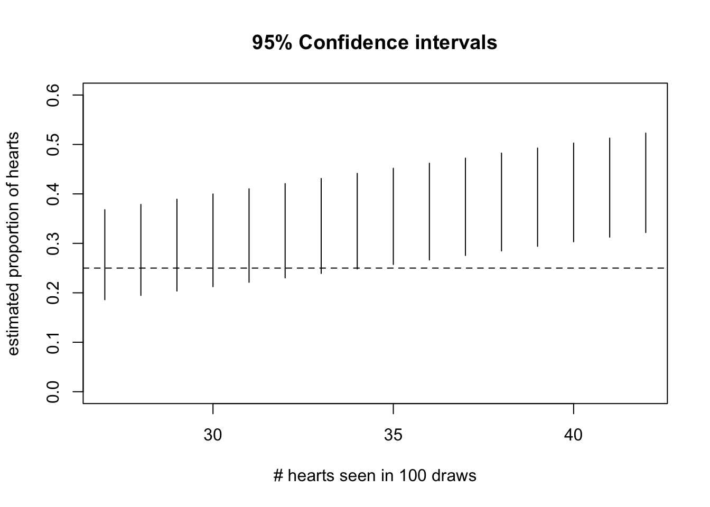

Exercise: For what value of the statistic would you reject the null
hypothesis of probability 1/4 for heart?

Exercise: Use 99% as the coverage probability and produce the display.

</div>

</div>

<div class="section level2">

## Multiple comparisons

Everything we’ve seen thus far looks at **a single test** in various
ways.

A hallmark of work in genomics is the necessity of performing many
tests, because of the large number of features and hypotheses in play.

Fact: When many tests are conducted on true null hypotheses, the
distribution of the collection of p-values thereby obtained is uniform
on (0,1\].

To illustrate this we will produce 10000 samples from N(100,1) and
conduct the t test with null mean 100, yielding 10000 p-values.

<div id="cb8" class="sourceCode">

``` r
many_x = replicate(10000, rnorm(10, 100))
many_p = apply(many_x, 2, function(x) t.test(x, mu=100)$p.value)
plot(density(many_p, from=0, to=1))
```

</div>

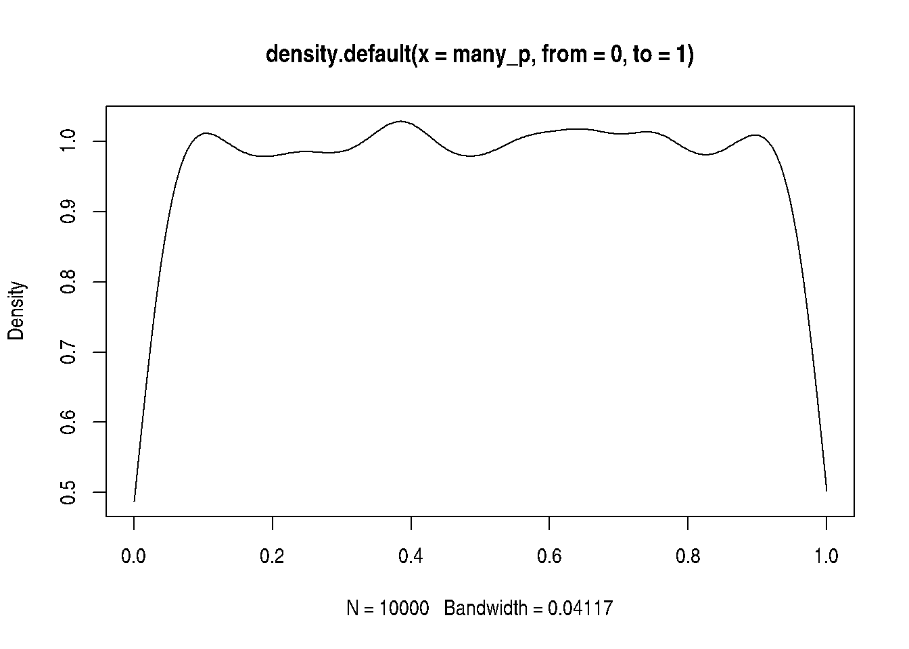

This display shows a limitation of density estimation on a fixed
interval – a “boundary effect”, because data “up against” the boundary
get sparser as you get closer to the boundary. But it is consistent with
the property of a uniform distribution on \[0,1\]: the true density is
1.

<div class="section level3">

### Bonferroni’s correction to achieve Family-Wise Error Rate (FWER) control

The concept of Type I error is very general, and could be deployed to
define operating characteristics for any kind of inference procedure.

This table is frequently seen in discussions of multiple testing, it is
from Holmes and Huber’s Modern Statistics for Modern Biology.

<div class="figure">

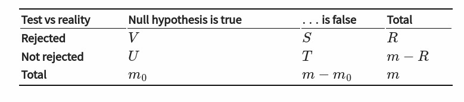

decisiontab

</div>

Suppose we have \\(m\\) hypotheses to test and we wish the overall
probability of our family of tests to have Type I error rate
\\(\\alpha\\). Using the table symbols, this is \\(Pr(V&gt;0) &lt;
\\alpha\\).

Bonferroni’s method is to declare significance only for those tests with
\\(p\\)-value less than \\(\\alpha/m\\).

This procedure (and related improvements for FWER control) also implies
a transformation of \\(p\\)-values, that we will see shortly.

</div>

<div class="section level3">

### False discovery rate

Referring to the table above, the false discovery rate (FDR) is the
expected value of \\(V/max(R,1)\\). If \\(R = 0\\), \\(V = 0\\) and FDR
is zero. Otherwise, we can think of FDR as a kind of budget: we will
reject \\(R\\) hypotheses and our expection is that \\(V\\) will be
false. If we are “following up” with confirmatory experiments on \\(R\\)
genes and can afford “wasting” \\(V\\) tests, we would accept an FDR of
\\(V/R\\).

Of course these are probabilistic characteristics of procedures that
hold with stated probabilities when assumptions are satisfied.

</div>

<div class="section level3">

### Adjusted p-values

Since we are so accustomed to the single-number summary \\(p\\), it is
typical to base rejection decisions on transformed \\(p\\)-values. The
multtest package takes care of this.

<div id="cb9" class="sourceCode">

``` r
library(multtest)
options(digits=3)
tab = mt.rawp2adjp(many_p)
head(tab[[1]],10)
```

</div>

    ##           rawp Bonferroni  Holm Hochberg SidakSS SidakSD    BH BY   ABH
    ##  [1,] 9.27e-05      0.927 0.927    0.927   0.604   0.604 0.645  1 0.645
    ##  [2,] 1.81e-04      1.000 1.000    1.000   0.836   0.836 0.645  1 0.645
    ##  [3,] 3.93e-04      1.000 1.000    1.000   0.980   0.980 0.645  1 0.645
    ##  [4,] 4.35e-04      1.000 1.000    1.000   0.987   0.987 0.645  1 0.645
    ##  [5,] 4.40e-04      1.000 1.000    1.000   0.988   0.988 0.645  1 0.645
    ##  [6,] 4.43e-04      1.000 1.000    1.000   0.988   0.988 0.645  1 0.645
    ##  [7,] 4.96e-04      1.000 1.000    1.000   0.993   0.993 0.645  1 0.645
    ##  [8,] 6.28e-04      1.000 1.000    1.000   0.998   0.998 0.645  1 0.645
    ##  [9,] 6.82e-04      1.000 1.000    1.000   0.999   0.999 0.645  1 0.645
    ## [10,] 7.14e-04      1.000 1.000    1.000   0.999   0.999 0.645  1 0.645
    ##       TSBH_0.05
    ##  [1,]     0.645
    ##  [2,]     0.645
    ##  [3,]     0.645
    ##  [4,]     0.645
    ##  [5,]     0.645
    ##  [6,]     0.645
    ##  [7,]     0.645
    ##  [8,]     0.645
    ##  [9,]     0.645
    ## [10,]     0.645

By default, `mt.rawp2adp` produces a number of adjustments – we are
concerned at present with the columns rawp (the p-values sorted from
lowest on), Bonferroni (which gives the transformation \\(p\\) to min(1,
mp)$ for \\(m\\) tests), and BH (the Benjamini-Hochberg FDR
transformation). The implication of this table is that with FWER control
at 0.05, our data would not support rejection of any of our hypotheses
(all of which assert that the mean of a sample of 10 random normals is
equal to 100). Likewise with FDR control at any value up to 0.77.
However, we see that had we accepted an FDR control at 0.8, we could
reject 8 hypotheses.

Exercise: replace the first p-value in `many_p` with `1e-6` and obtain
the associated adjusted p-values.

</div>

<div class="section level3">

### Adjustments via weighted FDR

A [useful
review](https://www.ncbi.nlm.nih.gov/pmc/articles/PMC10276986/) is
available. This section addresses only one of the methods in the review,
which is found to have good performance, though in some contexts the
authors’ alternatives appear superior.

<div class="section level4">

#### Setup

We need the IHW package and will do some visualization as well.

<div id="cb11" class="sourceCode">

``` r
 library(CSHstats)
 library(ggplot2)
 library(plotly)
 library(IHW)
 library(multtest)
```

</div>

Here’s the key resource with p-values that we want to interpret.

<div id="cb12" class="sourceCode">

``` r
data(gtex_exc_chr20_b38)
gtdat = gtex_exc_chr20_b38
head(gtdat,3)
```

</div>

    ##   chr pos_b38       marker         rsid effectallele otherallele    eaf     p
    ## 1  20   61066 20:61066:T:C rs1031667049            C           T 0.0285 0.774
    ## 2  20   61083 20:61083:C:T  rs956068117            T           C 0.1010 0.767
    ## 3  20   61098 20:61098:C:T  rs933208784            T           C 0.0155 0.117
    ##      beta     se              pheno mode       tag imputersq   n     Gene
    ## 1  0.0226 0.0784 ENSG00000196476.11 eqtl GTEx-eqtl        NA 515 C20orf96
    ## 2  0.0123 0.0413 ENSG00000196476.11 eqtl GTEx-eqtl        NA 515 C20orf96
    ## 3 -0.1615 0.1029 ENSG00000196476.11 eqtl GTEx-eqtl        NA 515 C20orf96
    ##   seqnames  start    end width strand         gene_id gene_name   gene_biotype
    ## 1       20 270863 290778 19916      - ENSG00000196476  C20orf96 protein_coding
    ## 2       20 270863 290778 19916      - ENSG00000196476  C20orf96 protein_coding
    ## 3       20 270863 290778 19916      - ENSG00000196476  C20orf96 protein_coding
    ##   seq_coord_system   symbol entrezid
    ## 1       chromosome C20orf96   140680
    ## 2       chromosome C20orf96   140680
    ## 3       chromosome C20orf96   140680

What we have here are variant-expression association tests conducted in
the [GTEx project](https://gtexportal.org). Thus this is a small excerpt
from a collection of “GWAS”, in which the outcome is tissue-specific
expression of a gene, and predictors are formed by SNP genotypes and
adjustments carried out in the GTEx analysis pipeline.

Here’s a composite manhattan plot:

<div id="cb14" class="sourceCode">

``` r
pl1 = ggplot(gtdat[gtdat$p<.1,], aes(x=pos_b38, y=-log10(p), colour=Gene)) + geom_point()
#ggplotly(pl1)
pl1
```

</div>

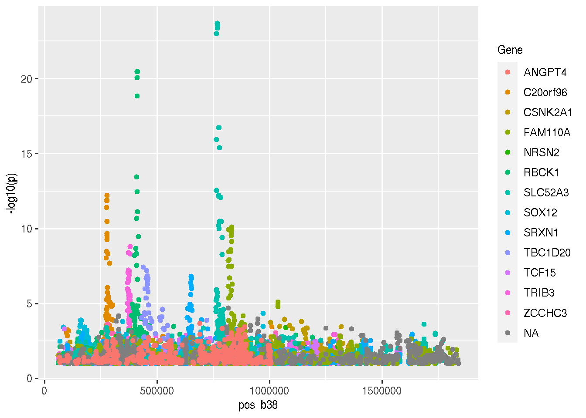

</div>

<div class="section level4">

#### Demonstration 1: Use allele frequency to form strata for FDR weighting

The `eaf` field is the frequency with which the “effect allele” was
reported by SNP-Nexus.

<div id="cb15" class="sourceCode">

``` r
covariate1 = cut(gtdat$eaf, c(0,.01,.05,.1,.3,.6))
table(covariate1)
```

</div>

    ## covariate1
    ##    (0,0.01] (0.01,0.05]  (0.05,0.1]   (0.1,0.3]   (0.3,0.6] 
    ##        3865       33697       13860       27840       20738

We run the IHW algorithm using the variant frequency strata, with a
conjecture that very rare or very common variants may be downweighted in
a way that is advantageous to discovery.

<div id="cb17" class="sourceCode">

``` r
demo1 = ihw(gtdat$p, covariate1, alpha=0.05)
basic_fdr = mt.rawp2adjp(gtdat$p)
```

</div>

The weighting procedure involves random resampling from the data, to
reduce risk of overfitting, and to allow assessment of consistency
across multiple “folds” or random subsets.

<div id="cb18" class="sourceCode">

``` r
plot(demo1)
```

</div>

    ## Warning: `aes_string()` was deprecated in ggplot2 3.0.0.
    ## ℹ Please use tidy evaluation idioms with `aes()`.
    ## ℹ See also `vignette("ggplot2-in-packages")` for more information.
    ## ℹ The deprecated feature was likely used in the IHW package.
    ##   Please report the issue to the authors.
    ## This warning is displayed once per session.
    ## Call `lifecycle::last_lifecycle_warnings()` to see where this warning was
    ## generated.

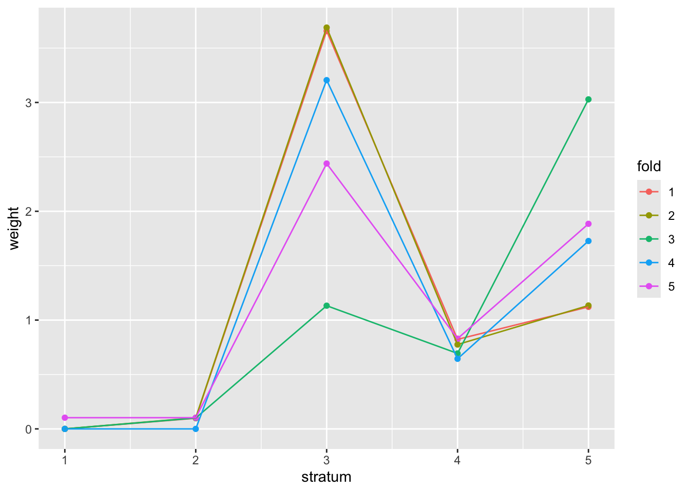

Compare the weighted, unweighted, and conventional rejection numbers:

<div id="cb20" class="sourceCode">

``` r
newp = adj_pvalues(demo1)
sum(newp < 0.05)
```

</div>

    ## [1] 276

<div id="cb22" class="sourceCode">

``` r
sum(basic_fdr$adjp[,"BH"] < 0.05)
```

</div>

    ## [1] 257

<div id="cb24" class="sourceCode">

``` r
sum(gtdat$p < 5e-8)
```

</div>

    ## [1] 68

</div>

<div class="section level4">

#### Demonstration 2: Use distance to gene to weight

<div id="cb26" class="sourceCode">

``` r
dist2gene = abs(gtdat$pos_b38-gtdat$start)
covariate2 = cut(dist2gene, 5)
ok = which(!is.na(covariate2))
demo2 = ihw(gtdat$p[ok], covariate2[ok], alpha=0.05)
plot(demo2)
```

</div>

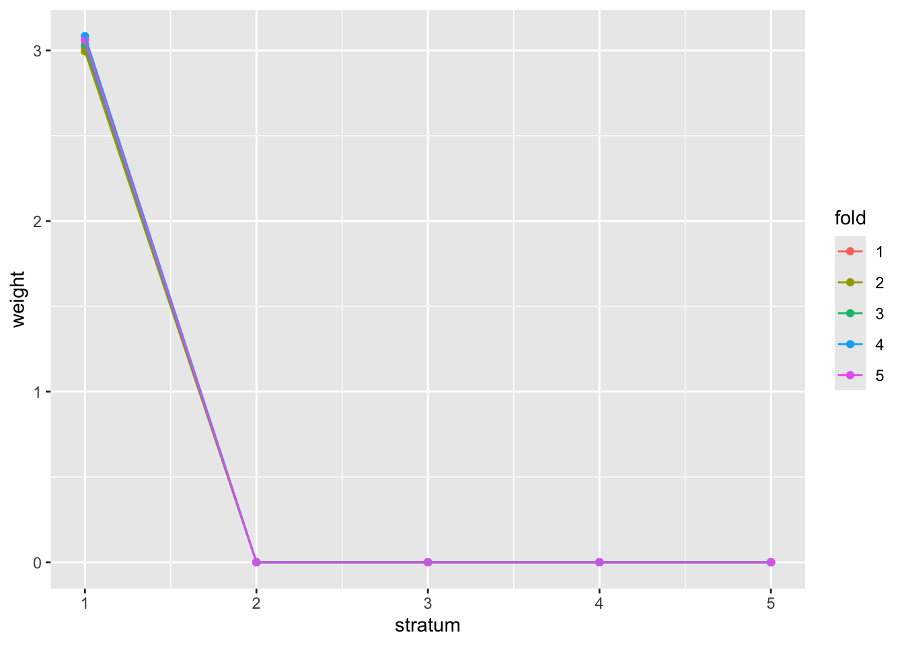

<div id="cb27" class="sourceCode">

``` r
newp2 = adj_pvalues(demo2)
sum(newp2 < 0.05)
```

</div>

    ## [1] 379

</div>

</div>

<div class="section level3">

### Optional: Considerations on Bayesian multiple testing

Various comments and references in this
[stackexchange](https://stats.stackexchange.com/questions/203378/why-dont-bayesian-methods-require-multiple-testing-corrections)
address the relationship between inferential framework and approach to
multiple testing. A [paper by Gelman and
Loken](http://www.stat.columbia.edu/~gelman/research/unpublished/p_hacking.pdf)
surveys the concept in an illuminating way.

A paper in the [European Journal of
Epidemiology](https://doi.org/10.1007/s10654-019-00517-2) presents
considerations on multiple comparisons from a Bayesian perspective,
arguing that the issue is “surrounded by confusion and controversy”.

Here is a simple approach to visualizing 20 tests, assumed independent,
in a frequenist framework, focusing on 95% confidence intervals.

<div id="cb29" class="sourceCode">

``` r
# from https://link.springer.com/content/pdf/10.1007/s10654-019-00517-2.pdf
# Sjolander and vanSteenlandt 2019 Eur J Epi

library(forestplot)
library(bayesm)
set.seed(1)

n = 10
J = 20
beta = 0
Y = matrix(rnorm(n*J, mean=beta), nrow=n, ncol=J)
est = colMeans(Y)
se = apply(X=Y, MARGIN=2, FUN=sd)/sqrt(n)
q = qt(p=0.975, df=n-1)
ci.l = est-q*se
ci.u = est+q*se

forestplot(
 labeltext=rep("", J),
 mean=est, lower=ci.l,
 upper=ci.u, ci.vertices=TRUE,
 boxsize=0.3, txt_gp=fpTxtGp(cex=2),
 xticks=seq(-1.5,1.5,.5), title="Frequentist 95% confidence intervals")
```

</div>

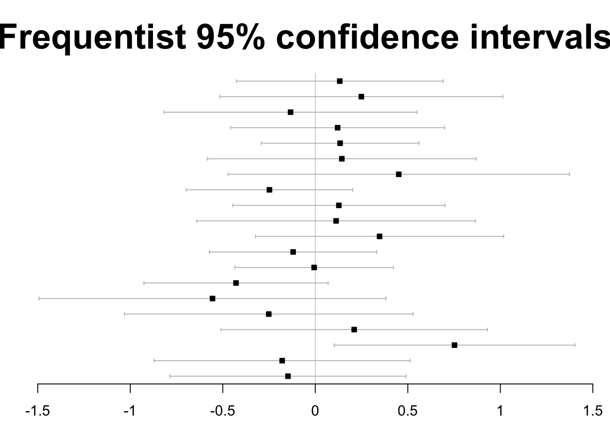

One hypothesis is rejected.

The authors also use the `bayesm` package to produce Bayesian credible
intervals **under the assumption that all tests are independent**.

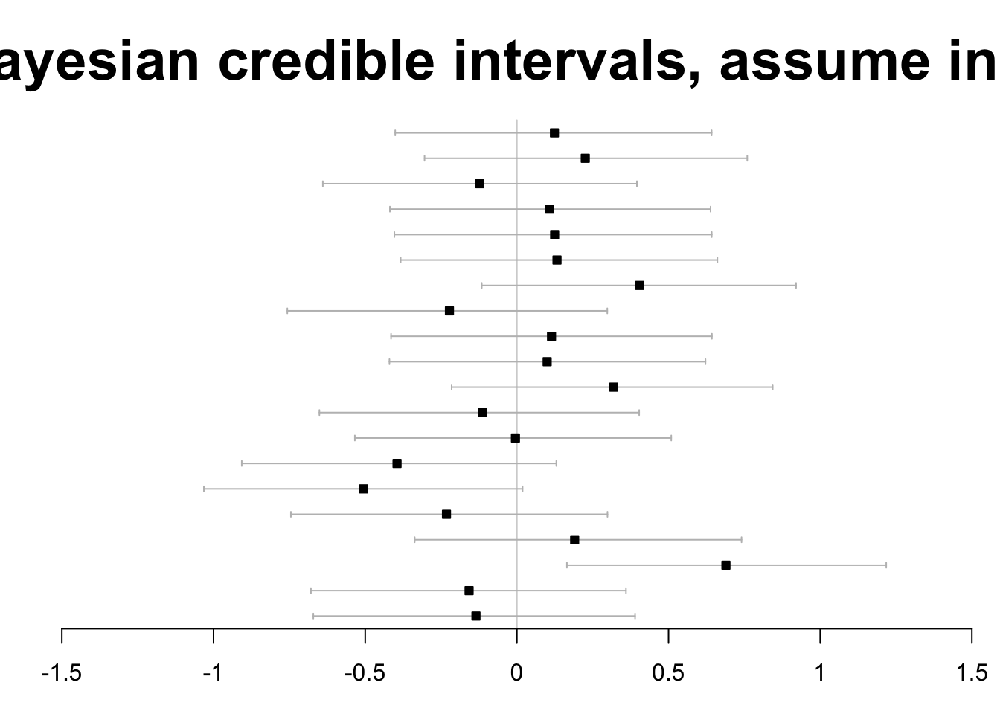

Finally, allowing high correlatedness among test statistics, the
Bayesian approach is found to avoid any false rejections.

<div id="cb30" class="sourceCode">

``` r
forestplot(
 labeltext=rep("", J),
 mean=est, lower=ci.l,
 upper=ci.u, ci.vertices=TRUE,
 boxsize=0.3, txt_gp=fpTxtGp(cex=2),
 xticks=seq(-1.5,1.5,.5), title="Bayesian, assume correlated tests")
```

</div>

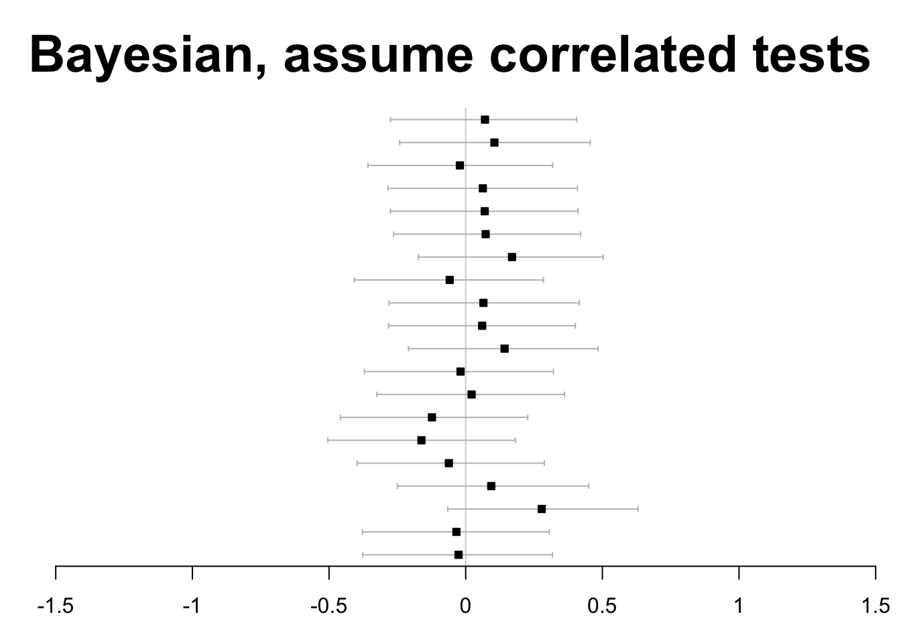

The Bayesian computations involve Monte Carlo Markov Chain simulation.
Background can be obtained from [Statistical
Rethinking](https://xcelab.net/rm/statistical-rethinking/) by R.
McElreath.

</div>

</div>

<div class="section level2">

## Linear models

<div class="section level3">

### Data setup

Let’s return to the TCGA ACC FOS and EGR1 data that we used to study
correlation.

<div id="cb31" class="sourceCode">

``` r
data(fos_ex)
data(egr1_ex)
fedf = data.frame(FOS=fos_ex, EGR1=egr1_ex)
library(ggplot2)
ggplot(fedf, aes(x=EGR1, y=FOS)) + geom_point()
```

</div>

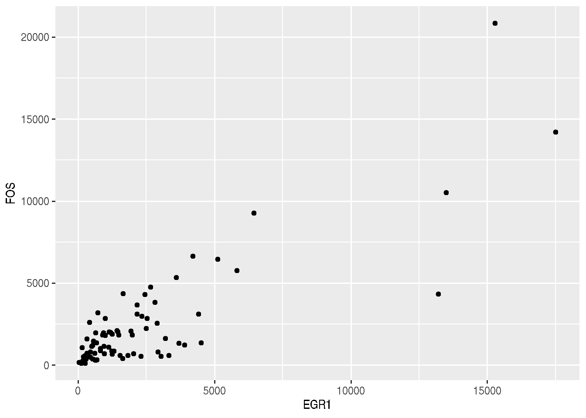

We found that log transformation was useful for ameliorating the
overplotting near the origin:

<div id="cb32" class="sourceCode">

``` r
ggplot(fedf, aes(x=EGR1, y=FOS)) + geom_point() + scale_x_log10() + scale_y_log10()
```

</div>

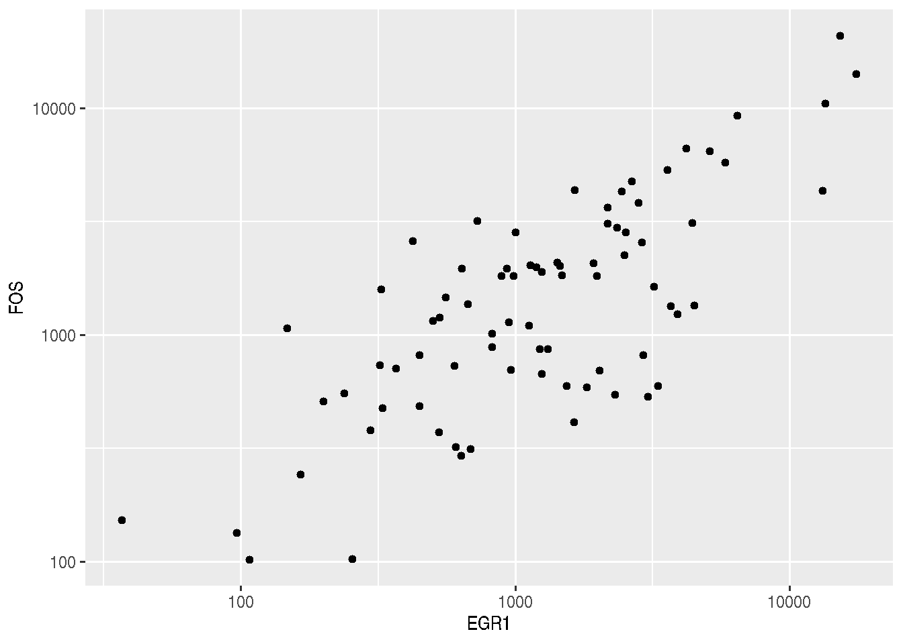

The ACC data are annotated in a MultiAssayExperiment, and a mutation
summary called OncoSign is available.

<div id="cb33" class="sourceCode">

``` r
library(MultiAssayExperiment)
library(CSHstats)
data(accex)
accex
```

</div>

    ## A MultiAssayExperiment object of 1 listed
    ##  experiment with a user-defined name and respective class.
    ##  Containing an ExperimentList class object of length 1:
    ##  [1] ACC_RNASeq2GeneNorm-20160128: SummarizedExperiment with 20501 rows and 79 columns
    ## Functionality:
    ##  experiments() - obtain the ExperimentList instance
    ##  colData() - the primary/phenotype DataFrame
    ##  sampleMap() - the sample coordination DataFrame
    ##  `$`, `[`, `[[` - extract colData columns, subset, or experiment
    ##  *Format() - convert into a long or wide DataFrame
    ##  assays() - convert ExperimentList to a SimpleList of matrices
    ##  exportClass() - save data to flat files

<div id="cb35" class="sourceCode">

``` r
table(accex$OncoSign, exclude=NULL)
```

</div>

    ## 
    ##          CN1          CN2       CTNNB1   TERT/ZNRF3     TP53/NF1 Unclassified 
    ##            4           13            5           17           21           14 
    ##         <NA> 
    ##            5

</div>

<div class="section level3">

### Re-expressing the two-sample test

We will focus on two OncoSign classes, asking whether average log EGR1
expression is different between them.

<div id="cb37" class="sourceCode">

``` r
hasonc = which(!is.na(accex$OncoSign))
ndf = data.frame(logEGR1 = log(egr1_ex[hasonc]), oncosign=accex$OncoSign[hasonc])
tpvtert = ndf |> dplyr::filter(oncosign %in% c("TP53/NF1", "TERT/ZNRF3"))
ggplot(tpvtert, aes(y=logEGR1, x=factor(oncosign))) + geom_boxplot()
```

</div>

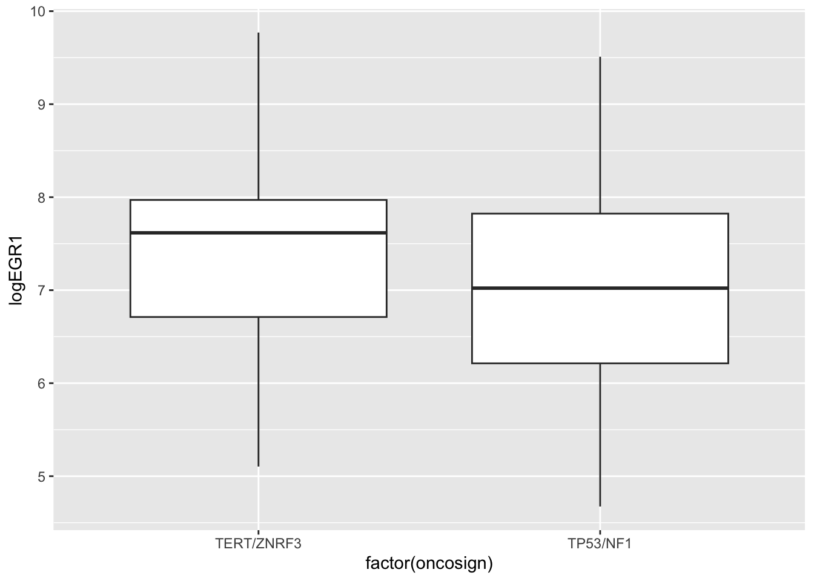

<div class="section level4">

#### There are two t tests

<div id="cb38" class="sourceCode">

``` r
options(digits=6)
t.test(logEGR1~oncosign, data=tpvtert, var.equal=TRUE)
```

</div>

    ## 
    ##  Two Sample t-test
    ## 
    ## data:  logEGR1 by oncosign
    ## t = 1.038, df = 36, p-value = 0.306
    ## alternative hypothesis: true difference in means between group TERT/ZNRF3 and group TP53/NF1 is not equal to 0
    ## 95 percent confidence interval:
    ##  -0.374199  1.158895
    ## sample estimates:
    ## mean in group TERT/ZNRF3   mean in group TP53/NF1 
    ##                  7.35317                  6.96083

<div id="cb40" class="sourceCode">

``` r
t.test(logEGR1~oncosign, data=tpvtert, var.equal=FALSE) # more general
```

</div>

    ## 
    ##  Welch Two Sample t-test
    ## 
    ## data:  logEGR1 by oncosign
    ## t = 1.046, df = 35.19, p-value = 0.303
    ## alternative hypothesis: true difference in means between group TERT/ZNRF3 and group TP53/NF1 is not equal to 0
    ## 95 percent confidence interval:
    ##  -0.369343  1.154039
    ## sample estimates:
    ## mean in group TERT/ZNRF3   mean in group TP53/NF1 
    ##                  7.35317                  6.96083

</div>

<div class="section level4">

#### The linear model has one of these as a special case

The general form of linear model in statistics has “dependent variable”
\\(y\\) \\\[ y = \\alpha + x' \\beta + e \\\] where \\(x\\) is a
p-vector of “covariates” – measurements that are believed to affect the
mean value of \\(y\\), also known as “independent variables”, and
\\(e\\) is a zero-mean disturbance or residual with a fixed dispersion.
The parameters of interest are \\(\\alpha\\) (often called intercept)
and \\(\\beta\\). **Parameter interpretation in terms of units of the
response relative to differences between samples with different values
of \\(x\\) should always be explicit.**

<div class="section level5">

##### A dummy variable design matrix

<div id="cb42" class="sourceCode">

``` r
mm = model.matrix(~oncosign, data=tpvtert)
head(mm)
```

</div>

    ##   (Intercept) oncosignTP53/NF1
    ## 1           1                1
    ## 2           1                1
    ## 3           1                0
    ## 4           1                1
    ## 5           1                0
    ## 6           1                1

<div id="cb44" class="sourceCode">

``` r
tail(mm)
```

</div>

    ##    (Intercept) oncosignTP53/NF1
    ## 33           1                0
    ## 34           1                1
    ## 35           1                0
    ## 36           1                0
    ## 37           1                1
    ## 38           1                1

</div>

<div class="section level5">

##### Recovering the t test with `lm`

<div id="cb46" class="sourceCode">

``` r
tpvtert |> lm(logEGR1~oncosign, data=_) |> summary()
```

</div>

    ## 
    ## Call:
    ## lm(formula = logEGR1 ~ oncosign, data = tpvtert)
    ## 
    ## Residuals:
    ##    Min     1Q Median     3Q    Max 
    ## -2.287 -0.721  0.167  0.625  2.549 
    ## 
    ## Coefficients:
    ##                  Estimate Std. Error t value Pr(>|t|)    
    ## (Intercept)         7.353      0.281   26.17   <2e-16 ***
    ## oncosignTP53/NF1   -0.392      0.378   -1.04     0.31    
    ## ---
    ## Signif. codes:  0 '***' 0.001 '**' 0.01 '*' 0.05 '.' 0.1 ' ' 1
    ## 
    ## Residual standard error: 1.16 on 36 degrees of freedom
    ## Multiple R-squared:  0.0291, Adjusted R-squared:  0.00209 
    ## F-statistic: 1.08 on 1 and 36 DF,  p-value: 0.306

Exercise: Which t test is recovered in this analysis?

Exercise: Conduct the associated Wilcoxon test.

Exercise: Conduct the Gaussian rank test mentioned in the Gelman blog
“Don’t do the Wilcoxon”.

Extra goody: To produce the coefficients “by hand”:

<div id="cb48" class="sourceCode">

``` r
solve(t(mm)%*%mm)%*%t(mm)%*%tpvtert$logEGR1
```

</div>

    ##                       [,1]
    ## (Intercept)       7.353174
    ## oncosignTP53/NF1 -0.392348

programs \\((X'X)^{-1}X'y\\)

</div>

</div>

</div>

<div class="section level3">

### Analysis of variance: F test

The analysis of variance is focused on comparison of multiple groups.
The EGR1-OncoSign relationship is a reasonable example where this could
be used.

<div id="cb50" class="sourceCode">

``` r
ggplot(ndf, aes(y=logEGR1, x=factor(oncosign))) + geom_boxplot()
```

</div>

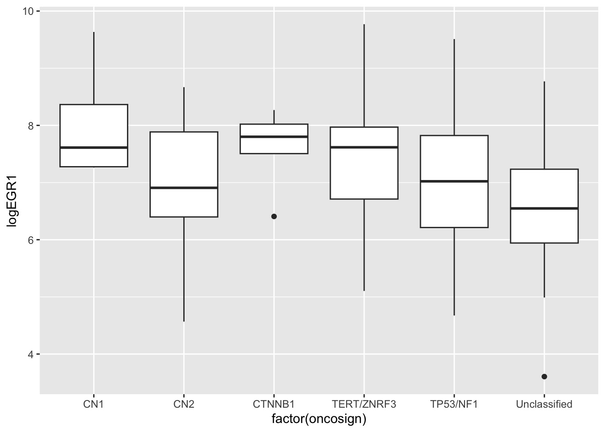

<div id="cb51" class="sourceCode">

``` r
nda = aov(logEGR1~factor(oncosign), data=ndf)
nda
```

</div>

    ## Call:
    ##    aov(formula = logEGR1 ~ factor(oncosign), data = ndf)
    ## 
    ## Terms:
    ##                 factor(oncosign) Residuals
    ## Sum of Squares           11.3084   92.1642
    ## Deg. of Freedom                5        68
    ## 
    ## Residual standard error: 1.1642
    ## Estimated effects may be unbalanced

<div id="cb53" class="sourceCode">

``` r
summary(nda)
```

</div>

    ##                  Df Sum Sq Mean Sq F value Pr(>F)
    ## factor(oncosign)  5   11.3    2.26    1.67   0.15
    ## Residuals        68   92.2    1.35

</div>

<div class="section level3">

### Linear regression, parameter estimation, goodness of fit

More common applications of linear modeling take advantage of continuity
of a predictor. For a simple linear regression (one continuous
covariate), the interpretation of \\(\\beta\\) is: the difference in
mean of \\(y\\) associated with a unit difference in \\(x\\).

Regarding log EGR1 as a predictor of log FOS, we have

<div id="cb55" class="sourceCode">

``` r
m1 = lm(log(fos_ex)~log(egr1_ex))
summary(m1)
```

</div>

    ## 
    ## Call:
    ## lm(formula = log(fos_ex) ~ log(egr1_ex))
    ## 
    ## Residuals:
    ##    Min     1Q Median     3Q    Max 
    ## -1.545 -0.482  0.198  0.476  1.397 
    ## 
    ## Coefficients:
    ##              Estimate Std. Error t value Pr(>|t|)    
    ## (Intercept)    2.2980     0.4975    4.62  1.5e-05 ***
    ## log(egr1_ex)   0.6895     0.0692    9.96  1.8e-15 ***
    ## ---
    ## Signif. codes:  0 '***' 0.001 '**' 0.01 '*' 0.05 '.' 0.1 ' ' 1
    ## 
    ## Residual standard error: 0.727 on 77 degrees of freedom
    ## Multiple R-squared:  0.563,  Adjusted R-squared:  0.557 
    ## F-statistic: 99.1 on 1 and 77 DF,  p-value: 1.75e-15

<div id="cb57" class="sourceCode">

``` r
plot(m1)
```

</div>

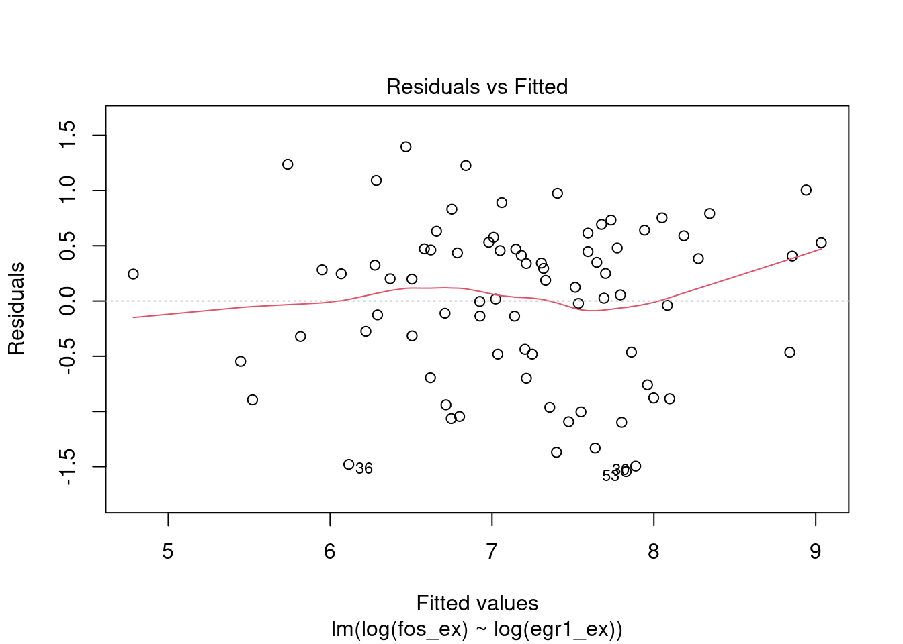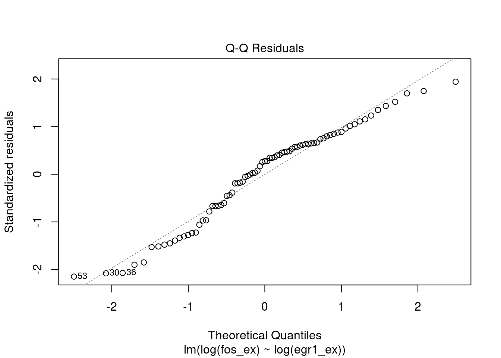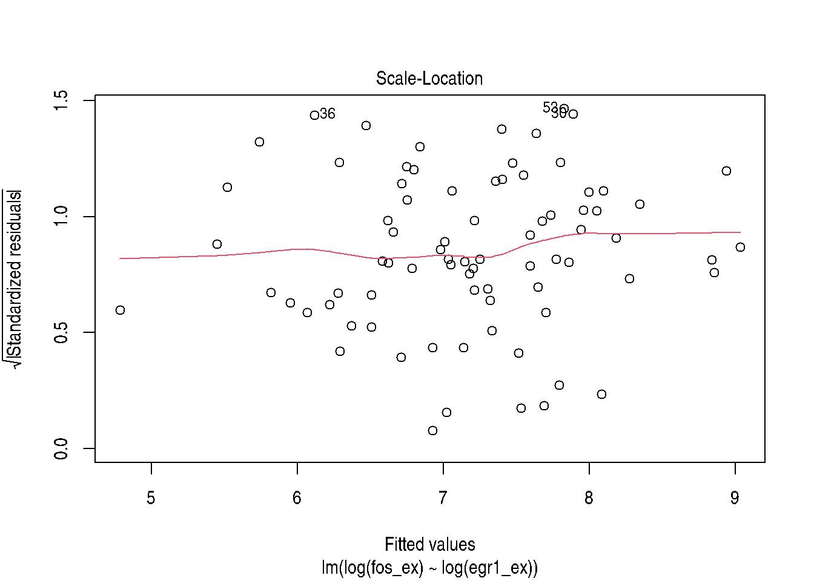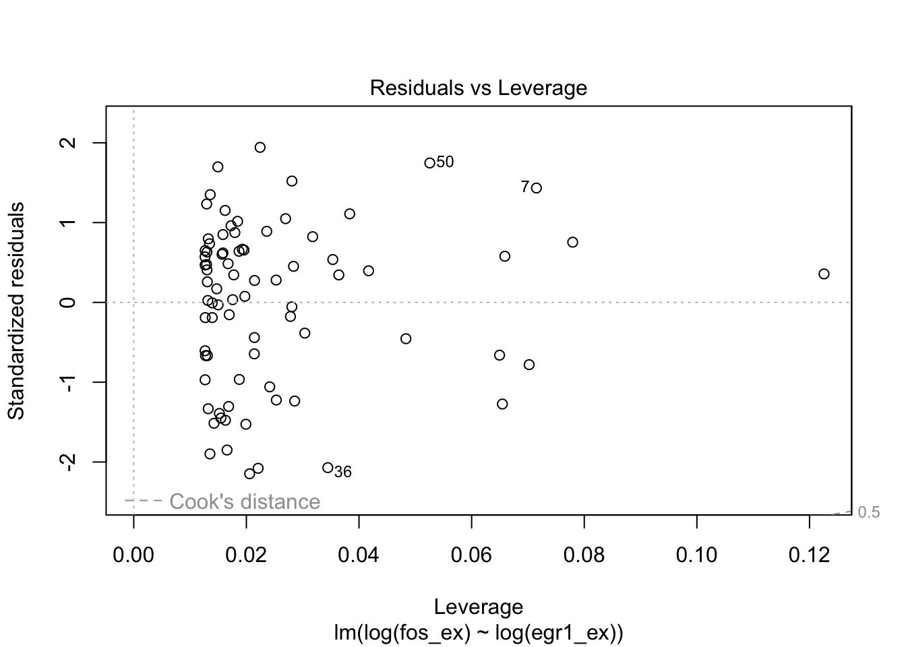

</div>

<div class="section level3">

### Confounding

</div>

</div>

<div class="section level2">

## GLMs: binary, counted, non-Gaussian responses

The family of generalized linear models (GLM) embraces a number of
approaches to statistical inference on associations between non-Gaussian
responses and general configurations of covariates.

<div class="section level3">

### Prologue: Fisher’s exact test for 2 x 2 table

We’ll work with FOS and EGR1 in an artificial way. We’ll suppose that we
have criteria for “activation”:

-   FOS is activated if our RNA-seq measurement in ACC exceeds 1000
-   EGR1 is activated if our RNA-seq measurement in ACC exceeds 2000

<div id="cb58" class="sourceCode">

``` r
library(CSHstats)
data(fos_ex)
data(egr1_ex)
fos_act = 1*(fos_ex > 1000)
egr1_act = 1*(egr1_ex > 2000)
```

</div>

We form a 2 x 2 cross classification of tumors using these definitions:

<div id="cb59" class="sourceCode">

``` r
acttab = table(fos_act=fos_act, egr1_act=egr1_act)
acttab
```

</div>

    ##        egr1_act
    ## fos_act  0  1
    ##       0 26  5
    ##       1 25 23

A basic question is whether the two events “EGR1 activated” and “FOS
activated” are statistically associated in ACC tumors.

Fisher’s exact test evaluates the hypergeometric distribution of the
(1,1) cell of the table, given the marginal totals.

<div id="cb61" class="sourceCode">

``` r
fisher.test(acttab, alternative="greater") # one-sided
```

</div>

    ## 
    ##  Fisher's Exact Test for Count Data
    ## 
    ## data:  acttab
    ## p-value = 0.0034
    ## alternative hypothesis: true odds ratio is greater than 1
    ## 95 percent confidence interval:
    ##  1.68701     Inf
    ## sample estimates:
    ## odds ratio 
    ##    4.69113

<div id="cb63" class="sourceCode">

``` r
sum(dhyper(26:31, 51, 28, 31))
```

</div>

    ## [1] 0.00339765

The odds of an event that occurs with probability \\(p\\) is given by
\\(p/(1-p)\\). Abbreviate to \\(odds(p)\\)

The odds ratio for two events with probabilities \\(p\_1\\) and
\\(p\_2\\) is \\(odds(p\_1)/odds(p\_2)\\). With a 2x2 table this can be
estimated with the cross ratio “ad/bc”. But the odds ratio estimated in
`fisher.test` is different, a conditional maximum likelihood estimate.
The difference is seldom meaningful.

<div id="cb65" class="sourceCode">

``` r
odds = function(x) {p=mean(x); p/(1-p)}
odds(fos_act[egr1_act==TRUE])/odds(fos_act[egr1_act==FALSE])
```

</div>

    ## [1] 4.784

<div id="cb67" class="sourceCode">

``` r
acttab[1,1]*acttab[2,2]/(acttab[1,2]*acttab[2,1])
```

</div>

    ## [1] 4.784

</div>

<div class="section level3">

### Binary response: logistic regression

We model the conditional probability that FOS is activated, depending on
whether or note EGR1 is activated, using the definitions given above.
The model has the form

\\\[ \\mbox{logit} Pr(FOS &gt; 1000\|EGR1&gt;2000) = \\alpha + \\beta x
\\\]

Here logit(p) = log(p/(1-p)) is called a “link function”. It transforms
the outcome of interest (a probability) from the interval (0,1) to the
whole real line. The interpretation of \\(\\beta\\) is: “log odds
ratio”. If we exponentiate beta, we obtain the effect of a change in x
of one unit on the odds of the response event.

<div id="cb69" class="sourceCode">

``` r
g1 = glm(fos_act ~ egr1_act, family=binomial())
summary(g1)
```

</div>

    ## 
    ## Call:
    ## glm(formula = fos_act ~ egr1_act, family = binomial())
    ## 
    ## Coefficients:
    ##             Estimate Std. Error z value Pr(>|z|)   
    ## (Intercept)  -0.0392     0.2801   -0.14   0.8886   
    ## egr1_act      1.5653     0.5673    2.76   0.0058 **
    ## ---
    ## Signif. codes:  0 '***' 0.001 '**' 0.01 '*' 0.05 '.' 0.1 ' ' 1
    ## 
    ## (Dispersion parameter for binomial family taken to be 1)
    ## 
    ##     Null deviance: 105.830  on 78  degrees of freedom
    ## Residual deviance:  96.958  on 77  degrees of freedom
    ## AIC: 101
    ## 
    ## Number of Fisher Scoring iterations: 3

Parameter interpretation. The intercept parameter has value -0.0392,
which is the logit of the probability that FOS is activated, given that
EGR1 is NOT activated.

The “beta” parameter is the log odds ratio (comparing probability of FOS
activation between the EGR1 conditions – not activated and activated).

<div id="cb71" class="sourceCode">

``` r
log(4.784)
```

</div>

    ## [1] 1.56528

</div>

<div class="section level3">

### Multiple logistic regression

Fisher’s exact test and simple logistic regression are seen to be
consistent with one another in this example. The advantage of the
logistic regression framework is that more potential sources of
variation in probability of response can be incorporated.

We have data on YY1 expression in ACC and will declare it activated when
expressed at a level greater than 1500.

<div id="cb73" class="sourceCode">

``` r
data(yy1_ex)
yy1_act = yy1_ex > 1500
g2 = glm(fos_act ~ egr1_act+yy1_act, family=binomial())
summary(g2)
```

</div>

    ## 
    ## Call:
    ## glm(formula = fos_act ~ egr1_act + yy1_act, family = binomial())
    ## 
    ## Coefficients:
    ##             Estimate Std. Error z value Pr(>|z|)   
    ## (Intercept)   0.0922     0.3175    0.29   0.7716   
    ## egr1_act      1.5690     0.5702    2.75   0.0059 **
    ## yy1_actTRUE  -0.4833     0.5472   -0.88   0.3771   
    ## ---
    ## Signif. codes:  0 '***' 0.001 '**' 0.01 '*' 0.05 '.' 0.1 ' ' 1
    ## 
    ## (Dispersion parameter for binomial family taken to be 1)
    ## 
    ##     Null deviance: 105.830  on 78  degrees of freedom
    ## Residual deviance:  96.177  on 76  degrees of freedom
    ## AIC: 102.2
    ## 
    ## Number of Fisher Scoring iterations: 3

The inclusion of information on YY1 does not seem to be informative on
FOS activation.

</div>

<div class="section level3">

### General case: link and variance functions

The family of generalized linear models can accommodate many forms of
variation in a response of interest, to which are associated a number of
“predictor” variables.

<div id="cb75" class="sourceCode">

``` r
kable(glmtab)
```

</div>

| dists    | links      | varfuns       |
|:---------|:-----------|:--------------|
| gaussian | identity   | const         |
| binomial | logit      | np(1-p)       |
| poisson  | log        | mu            |
| gamma    | reciprocal | mu^2          |
| negbin   | log        | mu+mu^2/theta |

DESeq2 and edgeR use the negative binomial GLM for inference on
differential expression in RNA-seq. You will hear much more about this.
The `glm.nb` function in the MASS package allows you to fit negative
binomial regressions with data in data.frames.

</div>

</div>

<div class="section level2">

## Hierarchical models: alternatives to independence

A very strong assumption in the use of linear and generalized linear
models is the mutual independence of reponses. When clustering of
responses is present (for example, when analyzing data collected on
human families, or pairs of eyes, or mice in litters), additional model
structure should be introduced to accommodate lack of independence.

<div class="section level3">

### Random effects models for clustered observations

A framework approach developed in [1982 (Laird and
Ware)](https://pubmed.ncbi.nlm.nih.gov/7168798/) expands the linear
model to a model known as “mixed effects”:

\\\[ y\_{ij} = \\alpha + \\beta x\_{ij} + a\_i + e\_{ij} \\\]

with \\(i\\) indexing clusters and \\(j\\) responses within clusters.
The “random effect” \\(a\_i\\) is assumed to follow \\(N(0,
\\sigma^2\_b)\\) (between-cluster variance), and is independent of
\\(e\_{ij} \\sim N(0, \\sigma^2\_w)\\).

The intraclass correlation coefficient measures the departure from
independence, and has form \\(\\rho = \\sigma^2\_b/(\\sigma^2\_b +
\\sigma^2\_w)\\).

Approximate mixed effects models for the GLM families can be fit using
glmmPQL in MASS.

</div>

</div>

</div>
