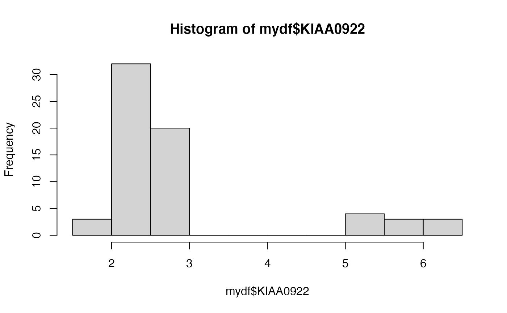
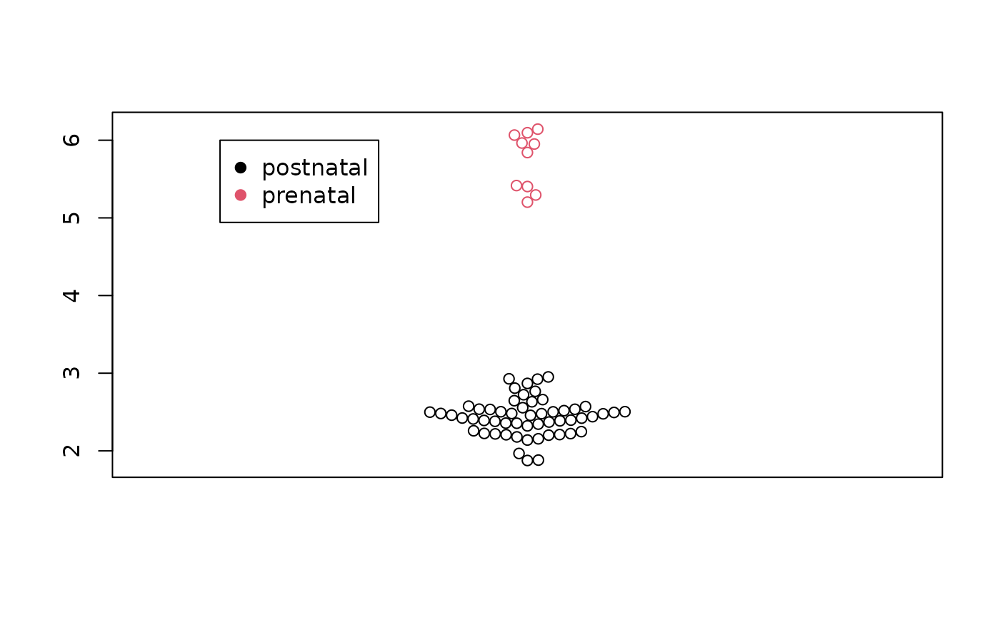
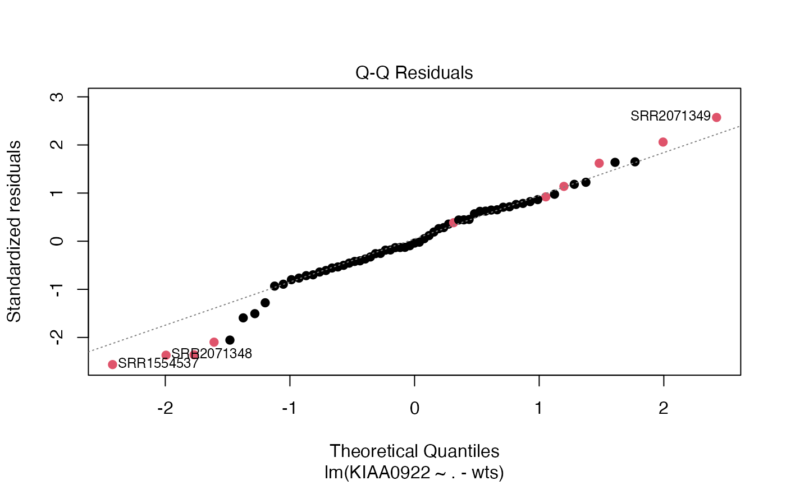

<div id="main" class="col-md-9" role="main">

# S5a: Diagnostics of a differential gene expression exercise

<div class="section level2">

## Fast forward

[This
document](https://lcolladotor.github.io/cshl_rstats_genome_scale_2023/differential-gene-expression-analysis-with-limma.html#differential-expression)
shows how SRP045638 can be retrieved and analyzed. We start with
filtered and normalized data in the `vGene` object.

<div id="cb1" class="sourceCode">

``` r
library(edgeR)
library(CSHstats)
data(vGene)
names(vGene)
```

</div>

    ## [1] "genes"   "targets" "E"       "weights" "design"

<div id="cb3" class="sourceCode">

``` r
head(vGene$E[,1:5])
```

</div>

    ##                   SRR2071341  SRR2071345 SRR2071346 SRR2071347 SRR2071348
    ## ENSG00000223972.5 -1.6548376 -3.43059162 -3.3104740  -2.641761 -3.9493303
    ## ENSG00000278267.1 -0.6717114 -0.19793086 -0.5977559  -2.156334  0.1381326
    ## ENSG00000227232.5  3.7573137  4.60832737  4.2686324   3.335519  4.5823511
    ## ENSG00000284332.1 -5.4961399 -5.75251971 -6.4803990  -4.963689 -7.6497700
    ## ENSG00000243485.5 -0.3668569 -0.02459926 -0.6475089  -3.378727  0.6310008
    ## ENSG00000237613.2 -5.4961399 -3.43059162 -4.1584709  -2.641761 -6.0648075

The model matrix is also important:

<div id="cb5" class="sourceCode">

``` r
data(mod)
head(mod)
```

</div>

    ##            (Intercept) prenatalprenatal sra_attribute.RIN sra_attribute.sexmale
    ## SRR2071341           1                0               8.3                     0
    ## SRR2071345           1                0               8.4                     1
    ## SRR2071346           1                0               8.7                     1
    ## SRR2071347           1                0               5.3                     0
    ## SRR2071348           1                1               9.6                     0
    ## SRR2071349           1                1               6.4                     0
    ##            assigned_gene_prop
    ## SRR2071341          0.4376474
    ## SRR2071345          0.7776021
    ## SRR2071346          0.8054366
    ## SRR2071347          0.8374639
    ## SRR2071348          0.6956363
    ## SRR2071349          0.6855766

Here are the top results from the limma-voom analysis:

<div id="cb7" class="sourceCode">

``` r
data(de_results)
options(digits=3)
de_results[1:5, c("gene_name", "logFC", "t", "P.Value", "adj.P.Val")]
```

</div>

    ##                    gene_name logFC    t  P.Value adj.P.Val
    ## ENSG00000121210.15  KIAA0922  3.28 41.9 4.24e-49  1.99e-44
    ## ENSG00000143494.15     VASH2  5.44 37.9 2.56e-46  6.01e-42
    ## ENSG00000176371.13    ZSCAN2  2.74 36.6 2.14e-45  3.34e-41
    ## ENSG00000196150.13    ZNF250  2.51 35.7 1.07e-44  1.25e-40
    ## ENSG00000103044.10      HAS3  2.49 35.1 2.69e-44  2.53e-40

This is a little different from the `de_results` computed in the class
document – because we sort by p and take the most significant results.

</div>

<div class="section level2">

## Assessing the association “by hand”

The `vGene$E` structure holds the estimated expression values, and
`vGene$weights` are quantities that measure relative variability of the
quantities in `E`. We can pick a gene of interest and examine the
marginal distribution and estimate association.

The top DE gene was “ENSG00000121210.15”. Let’s make a data.frame with
the E values, the covariates, and the weights.

<div id="cb9" class="sourceCode">

``` r
target = "ENSG00000121210.15"
ind = which(rownames(vGene$E)==target)
mydf = data.frame(cbind(KIAA0922=vGene$E[ind,],
      mod[,-1], wts=vGene$weights[ind,]))
```

</div>

Now examine the marginal distribution:

<div id="cb10" class="sourceCode">

``` r
hist(mydf$KIAA0922)
```

</div>



Interesting. There’s a big gap in the KIAA0922 expression distribution.

Exercise: Is that true for the “raw” data, or is it an artifact of all
the computations we’ve done?

<div id="cb11" class="sourceCode">

``` r
library(beeswarm)
beeswarm(mydf$KIAA0922, pwcol=as.numeric(factor(mydf$prenatalprenatal)))
legend(.6,6,legend=c("postnatal", "prenatal"), col=c(1,2), pch=19)
```

</div>



Finally, we fit the linear model:

<div id="cb12" class="sourceCode">

``` r
m1 = lm(KIAA0922~.-wts, data=mydf, weights=wts)
summary(m1)
```

</div>

    ## 
    ## Call:
    ## lm(formula = KIAA0922 ~ . - wts, data = mydf, weights = wts)
    ## 
    ## Weighted Residuals:
    ##     Min      1Q  Median      3Q     Max 
    ## -1.2228 -0.2991 -0.0211  0.3462  1.2114 
    ## 
    ## Coefficients:
    ##                       Estimate Std. Error t value Pr(>|t|)    
    ## (Intercept)            3.10928    0.34095    9.12  6.2e-13 ***
    ## prenatalprenatal       3.28305    0.07267   45.18  < 2e-16 ***
    ## sra_attribute.RIN     -0.00449    0.03444   -0.13   0.8968    
    ## sra_attribute.sexmale  0.10582    0.06705    1.58   0.1197    
    ## assigned_gene_prop    -0.96639    0.28639   -3.37   0.0013 ** 
    ## ---
    ## Signif. codes:  0 '***' 0.001 '**' 0.01 '*' 0.05 '.' 0.1 ' ' 1
    ## 
    ## Residual standard error: 0.547 on 60 degrees of freedom
    ## Multiple R-squared:  0.973,  Adjusted R-squared:  0.971 
    ## F-statistic:  545 on 4 and 60 DF,  p-value: <2e-16

<div id="cb14" class="sourceCode">

``` r
plot(m1, which=2, col=(as.numeric(mydf$prenatalprenatal)+1), pch=19)
```

</div>



</div>

</div>
