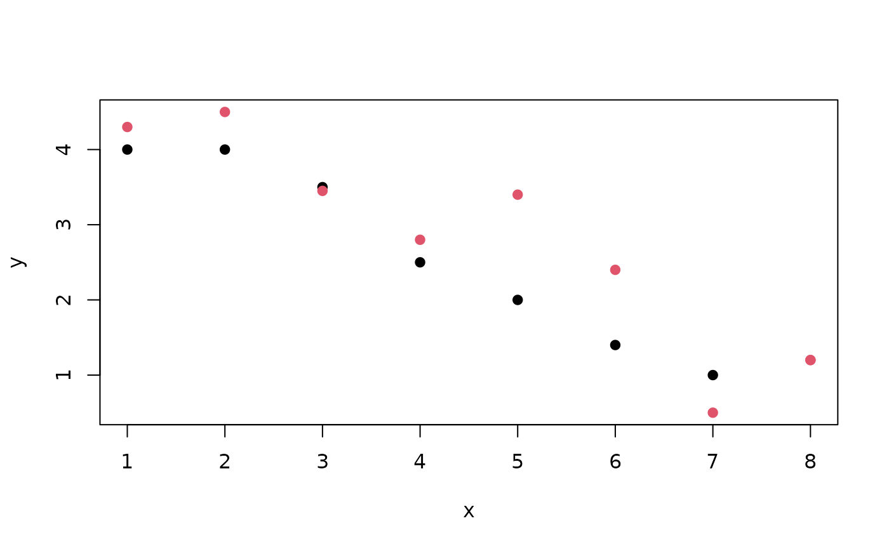
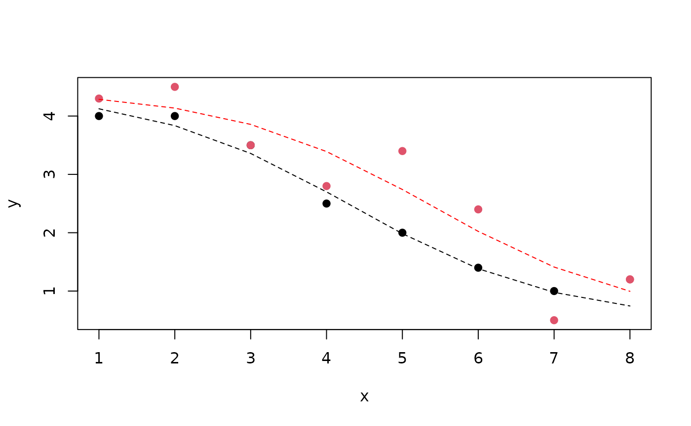

<div id="main" class="col-md-9" role="main">

# S5b: hypothesis testing in nonlinear regression

<div class="section level2">

## Logistic curve with response decreasing in x

Let a denote the asymptotic response at large values of x and b denote
the response at x=0. c will denote a slope-like parameter, and d the
midpoint of transition between asymptotes.

<div id="cb1" class="sourceCode">

``` r
a = 4
b = 1
c = 0.8
d = 4.5
x = 0:10
y = a + (b-a)/(1+exp(-c*(x-d)))
plot(x,y,type="b", ylim=c(0,5))
```

</div>


A variety of S-shaped curves can be produced depending on choices of the
parameters.

Exercise: Increase the value of the parameter c, recompute y, and
overlay on the plot with lines() and lty=2.

</div>

<div class="section level2">

## Fitting the model to data

The `nls` function can fit this model. We have some data that were
crafted to illustrate a “pair” of curves that can be regarded as shifted
instances of common shape. Here the color distinguishes the elements of
the pair.

<div id="cb2" class="sourceCode">

``` r
library(CSHstats)
data(nonlindat)
plot(y~x,data=nonlindat, col=nonlindat$z+1, pch=19)
```

</div>



We are modeling a pair of experiments in which the red points arise from
a different condition than the black points. The null hypothesis that
the curves are identical is tested using a parameter ‘del’ measuring the
shift in the response curve. An indicator variable z takes value 0 for
control condition and 1 for the active treatment.

<div id="cb3" class="sourceCode">

``` r
nl1 <- nls(y ~ 
 a + ((b - a)/(1 + exp(-c * (x - d*(1+del*z))))), 
 start = list(a = min(y), b = max(y), c = 1, 
 d = round(median(x)), del=0), data=nonlindat)
summary(nl1)
```

</div>

    ## 
    ## Formula: y ~ a + ((b - a)/(1 + exp(-c * (x - d * (1 + del * z)))))
    ## 
    ## Parameters:
    ##     Estimate Std. Error t value Pr(>|t|)    
    ## a     4.4419     0.6008   7.393 1.37e-05 ***
    ## b     0.4829     0.9835   0.491 0.633037    
    ## c     0.7281     0.4401   1.654 0.126290    
    ## d     4.3314     0.7326   5.912 0.000101 ***
    ## del   0.2412     0.1244   1.939 0.078521 .  
    ## ---
    ## Signif. codes:  0 '***' 0.001 '**' 0.01 '*' 0.05 '.' 0.1 ' ' 1
    ## 
    ## Residual standard error: 0.4515 on 11 degrees of freedom
    ## 
    ## Number of iterations to convergence: 14 
    ## Achieved convergence tolerance: 4.863e-06

Let’s use the model to overlay predicted response curves on the original
data.

<div id="cb5" class="sourceCode">

``` r
plot(y~x,data=nonlindat, col=nonlindat$z+1, pch=19)
nd = data.frame(x=1:8,z=0)
y1 = predict(nl1, newdata=nd)
lines(1:8, y1, lty=2)
nd2 = data.frame(x=1:8,z=1)
y2 = predict(nl1, newdata=nd2)
lines(1:8, y2, lty=2, col="red")
```

</div>



In summary, there is some evidence of a shift, location of inflection
point shifted by about 0.24 in units of x, with a p-value of about
0.079. It seems clear that the model fits one condition much better than
the other.

Exercise: The abline function can be used to sketch aspects of the model
over the plot just given. For example, `abline(h=4.4419, lty=2)` draws a
dashed line representing the fitted upper asymptote. Use the estimated
a, b, d parameters to draw “cross-hairs” showing the location of the
inflection point for the black curve, by filling in the appropriate
values of `abline(v=?, h=?)`.

Exercise (advanced): Test the hypothesis that the two conditions have
different asymptotic values as x increases.

</div>

</div>
