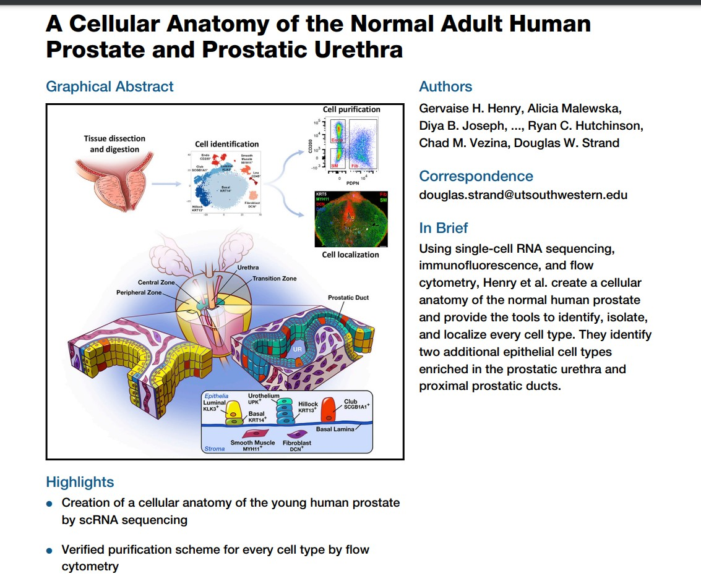
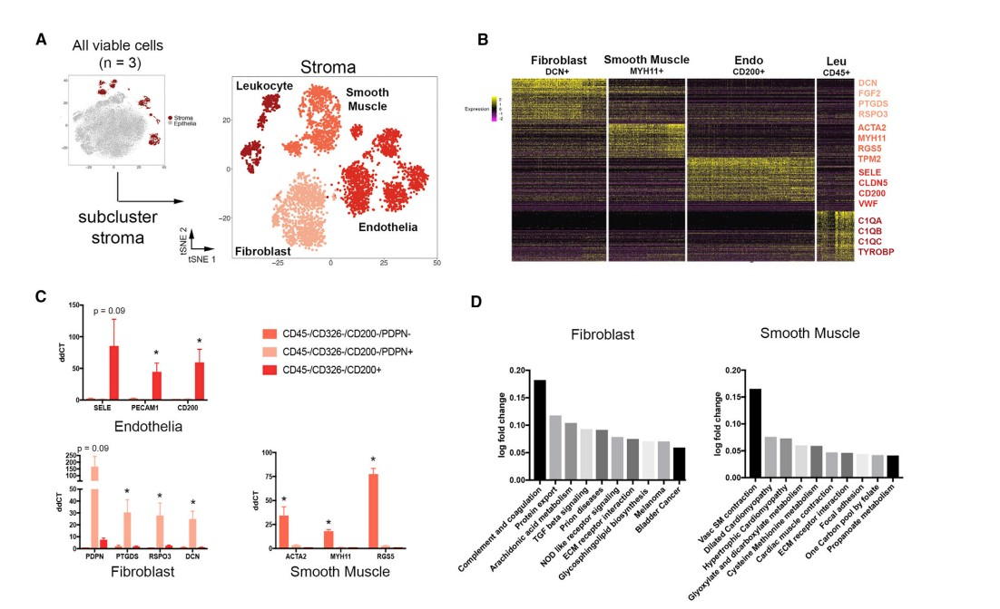
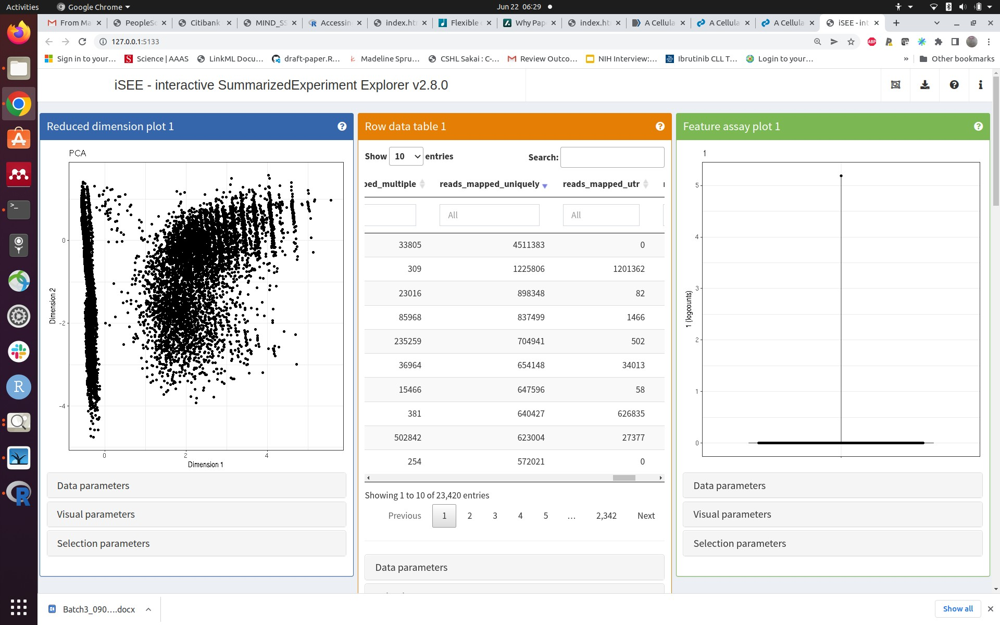
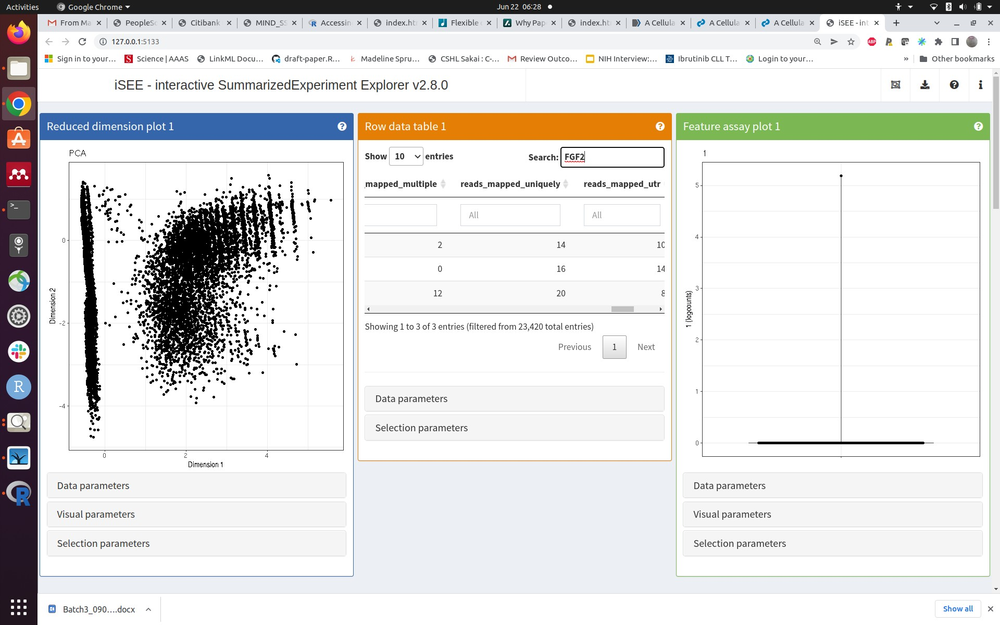

<div id="main" class="col-md-9" role="main">

# S6 HCA, ontologies, shiny

<div class="section level2">

## Road map

-   Bioconductor reads a paper
-   ontoProc and rols help with ontologies
-   shiny helps communicate

</div>

<div class="section level2">

## A paper on the atlas of the prostate

<div class="figure">



overview

</div>

<div class="figure">



normals

</div>

<div class="section level3">

### The CuratedAtlasQueryR package

`CuratedAtlasQueryR` offers a maintained interface to harmonized
single-cell atlas metadata and count data. Instead of browsing HCA
projects and then downloading loom files, we can query the atlas
directly by tissue, assay, annotation, and other harmonized variables.

<div class="section level4">

#### Surveying the curated atlas

<div id="cb1" class="sourceCode">

``` r
caq_metadata = CuratedAtlasQueryR::get_metadata(
    remote_url = CuratedAtlasQueryR::SAMPLE_DATABASE_URL
)
caq_summary = caq_metadata |>
    dplyr::summarise(
        datasets = dplyr::n_distinct(dataset_id),
        files = dplyr::n_distinct(file_id),
        tissues = dplyr::n_distinct(tissue),
        cell_types = dplyr::n_distinct(cell_type)
    ) |>
    dplyr::collect()
knitr::kable(caq_summary)
```

</div>

| datasets | files | tissues | cell\_types |
|---------:|------:|--------:|------------:|
|       63 |    63 |      33 |          32 |

</div>

<div class="section level4">

#### Looking at available tissue and cell-type combinations

<div id="cb2" class="sourceCode">

``` r
caq_examples = caq_metadata |>
    # sample_ is the upstream harmonized sample identifier, renamed here for display
    dplyr::select(
        dataset_id, tissue, cell_type, assay,
        sample_id = sample_
    ) |>
    dplyr::distinct() |>
    dplyr::arrange(tissue, cell_type) |>
    dplyr::collect()
caq_examples = head(caq_examples, 12)
knitr::kable(caq_examples)
```

</div>

| dataset\_id                          | tissue        | cell\_type                                            | assay     | sample\_id                       |
|:-------------------------------------|:--------------|:------------------------------------------------------|:----------|:---------------------------------|
| 76347874-8801-44bf-9aea-0da21c78c430 | adrenal gland | effector CD8-positive, alpha-beta T cell              | 10x 3’ v3 | 321f32ab8436164a1f515b54a68d9751 |
| 76347874-8801-44bf-9aea-0da21c78c430 | axilla        | effector CD8-positive, alpha-beta T cell              | 10x 3’ v3 | 0922d899f004a4303b6593ddd5fb97bf |
| 59b69042-47c2-47fd-ad03-d21beb99818f | blood         | CD16-negative, CD56-bright natural killer cell, human | 10x 3’ v3 | d611df00a2ea437cbb012da8c7c19f45 |
| 59b69042-47c2-47fd-ad03-d21beb99818f | blood         | CD16-negative, CD56-bright natural killer cell, human | 10x 3’ v3 | 0b6f0388f516464e0bce9b8ffb002bae |
| 4c4cd77c-8fee-4836-9145-16562a8782fe | blood         | CD16-negative, CD56-bright natural killer cell, human | 10x 3’ v3 | 03ba71b96d7b946f5748abf62894d327 |
| 4c4cd77c-8fee-4836-9145-16562a8782fe | blood         | CD16-negative, CD56-bright natural killer cell, human | 10x 3’ v3 | 1ea45b6ba0258fbc5971c34a3985d3da |
| 5e717147-0f75-4de1-8bd2-6fda01b8d75f | blood         | CD16-negative, CD56-bright natural killer cell, human | 10x 3’ v3 | d91e5c813881aa1f413b1f829a1613a5 |
| 5e717147-0f75-4de1-8bd2-6fda01b8d75f | blood         | CD16-negative, CD56-bright natural killer cell, human | 10x 3’ v3 | 9eb56b334fd105879257b3b69c7cdba6 |
| 5e717147-0f75-4de1-8bd2-6fda01b8d75f | blood         | CD16-negative, CD56-bright natural killer cell, human | 10x 3’ v3 | 5a129f42baa0758bccab877b6e3ff60d |
| 5e717147-0f75-4de1-8bd2-6fda01b8d75f | blood         | CD16-negative, CD56-bright natural killer cell, human | 10x 3’ v2 | 3c2678826f3a1e984657402038b9c976 |
| 4c4cd77c-8fee-4836-9145-16562a8782fe | blood         | CD16-negative, CD56-bright natural killer cell, human | 10x 3’ v3 | 4d56f21c88c599460333fba42201cc94 |
| 5e717147-0f75-4de1-8bd2-6fda01b8d75f | blood         | CD16-negative, CD56-bright natural killer cell, human | 10x 3’ v3 | 1ff8a479ad1da47748de60c84a2428cf |

</div>

<div class="section level4">

#### Retrieving a `SingleCellExperiment`

`CuratedAtlasQueryR` can return a `SingleCellExperiment` directly, so
the intermediate loom import step is unnecessary.

Very superficial filtering (to 60000 cells) and development of PCA

<div id="cb3" class="sourceCode">

``` r
library(scater)
library(scuttle)

sf1 = caq_metadata |>
    dplyr::filter(
        # Match 10x Genomics Chromium assays in the harmonized metadata
        stringr::str_like(stringr::str_to_lower(assay), "%10x%"),
        tissue == "lung parenchyma",
        stringr::str_like(cell_type, "%CD4%")
    ) |>
    CuratedAtlasQueryR::get_single_cell_experiment()
sf1
names(colData(sf1))
assay(sf1[1:4,1:4])
max_cells = 60000
sce_subset = sf1[,1:min(max_cells, ncol(sf1))]
z = DelayedArray::rowSums(assay(sce_subset))
mean(z==0)
todrop = which(z==0)
litsf2 = sce_subset[-todrop,]
assay(litsf2)
litsf2 = logNormCounts(litsf2)
litsf2 = runPCA(litsf2)
```

</div>

Once `litsf2` is available, the downstream exploration is unchanged.

</div>

<div class="section level4">

#### Working with iSEE

-   Question: where is the “stop/exit” button?
-   Question: can we embed iSEE (or components) in a vignette? Or is
    there an iSEE server?

<div class="figure">



context

</div>

<div class="figure">



fgf2

</div>

</div>

</div>

<div class="section level3">

### Upshots

-   easy to survey a harmonized atlas with CuratedAtlasQueryR
-   easy to get experiments, metadata, quantifications for queries of
    interest
-   iSEE really accelerates exploration and elaboration of data and
    claims

</div>

</div>

<div class="section level2">

## Ontologies, EBI OLS, rols (thanks Laurent Gatto!), ontoProc::ctmarks

<div class="section level3">

### Definition: from Wikipedia

In computer science and information science, an ontology encompasses a
representation, formal naming, and definition of the categories,
properties, and relations between the concepts, data, and entities that
substantiate one, many, or all domains of discourse. More simply, an
ontology is a way of showing the properties of a subject area and how
they are related, by defining a set of concepts and categories that
represent the subject.

Every academic discipline or field creates ontologies to limit
complexity and organize data into information and knowledge. Each uses
ontological assumptions to frame explicit theories, research and
applications. New ontologies may improve problem solving within that
domain. Translating research papers within every field is a problem made
easier when experts from different countries maintain a controlled
vocabulary of jargon between each of their languages.

</div>

<div class="section level3">

### Applications in genomics

-   Gene Ontology: Genes and gene products in subdomains of BP, MF, CC –
    biological process, molecular function, cellular component
-   Human Phenotype Ontology
-   UBERON - cross-species anatomy
-   Cell ontology
-   Cell line ontology
-   EFO - experimental factor ontology

Tags from any of these can be encountered in various annotation
resources.

</div>

<div class="section level3">

### rols: Basic idea

-   OLS is ontology lookup service
-   has API
-   rols package help to interrogate the service
-   ontologies are everywhere

</div>

<div class="section level3">

### Learn about ‘smooth muscle’ with rols

<div id="cb4" class="sourceCode">

``` r
library(rols)
ss = OlsSearch("smooth muscle", rows=100)
ss
```

</div>

    ## Object of class 'OlsSearch':
    ##   query: smooth muscle 
    ##   requested: 100 (out of 59450)
    ##   response(s): 0

<div id="cb6" class="sourceCode">

``` r
tt = olsSearch(ss)
dd = as(tt, "data.frame")
knitr::kable(head(dd, 12))
```

</div>

| iri                                           | ontology\_name | ontology\_prefix | short\_form   | description | label                | obo\_id      | type  | exact\_synonyms | related\_synonyms | narrow\_synonyms | broad\_synonyms |
|:----------------------------------------------|:---------------|:-----------------|:--------------|:------------|:---------------------|:-------------|:------|:----------------|:------------------|:-----------------|:----------------|
| <http://purl.obolibrary.org/obo/BTO_0001260>  | bto            | BTO              | BTO\_0001260  | Muscle t….  | smooth muscle        | BTO:0001260  | class |                 |                   |                  |                 |
| <http://www.ebi.ac.uk/efo/EFO_0000889>        | efo            | EFO              | EFO\_0000889  | Muscle t….  | smooth muscle        | EFO:0000889  | class | adult vi….      |                   |                  |                 |
| <http://purl.obolibrary.org/obo/WBbt_0005781> | wbbt           | WBbt             | WBbt\_0005781 |             | smooth muscle        | WBbt:0005781 | class |                 |                   |                  |                 |
| <http://purl.obolibrary.org/obo/XAO_0000175>  | xao            | XAO              | XAO\_0000175  | Involunt….  | smooth muscle        | XAO:0000175  | class |                 | visceral….        |                  |                 |
| <http://purl.obolibrary.org/obo/ZFA_0005274>  | zfa            | ZFA              | ZFA\_0005274  | A non-st….  | smooth muscle        | ZFA:0005274  | class |                 |                   |                  |                 |
| <http://purl.obolibrary.org/obo/TAO_0005274>  | tao            | NA               | TAO\_0005274  | A non-st….  | smooth muscle        | TAO:0005274  | class |                 |                   |                  |                 |
| <http://purl.obolibrary.org/obo/WBbt_0005781> | wbphenotype    | WBPhenotype      | WBbt\_0005781 |             | smooth muscle        | WBbt:0005781 | class |                 |                   |                  |                 |
| <http://purl.obolibrary.org/obo/XAO_0000175>  | xpo            | XPO              | XAO\_0000175  | Involunt….  | smooth muscle        | XAO:0000175  | class |                 | visceral….        |                  |                 |
| <http://purl.obolibrary.org/obo/ZFA_0005274>  | zfs            | ZFS              | ZFA\_0005274  | A non-st….  | smooth muscle        | ZFA:0005274  | class |                 |                   |                  |                 |
| <http://purl.obolibrary.org/obo/ZFA_0005274>  | zp             | ZP               | ZFA\_0005274  |             | smooth muscle        | ZFA:0005274  | class |                 |                   |                  |                 |
| <http://purl.obolibrary.org/obo/NCIT_C12437>  | ncit           | NCIT             | NCIT\_C12437  | Involunt….  | Smooth Muscle Tissue | NCIT:C12437  | class | MUSCLE, ….      |                   |                  |                 |
| <http://id.nlm.nih.gov/mesh/D009130>          | mesh           | mesh             | mesh\_D009130 | Unstriat….  | Muscle, Smooth       | mesh:D009130 | class |                 | Involunt….        |                  |                 |

</div>

<div class="section level3">

### ontoProc – capitalizing on ontologyIndex (thanks Daniel Greene!), Rgraphviz (thanks Kasper Hansen!)

<div id="cb7" class="sourceCode">

``` r
library(ontoProc)
co = getOnto("cellOnto")
```

</div>

    ## loading from cache

<div id="cb9" class="sourceCode">

``` r
head(co$name)
```

</div>

    ##              BFO:0000002              BFO:0000003              BFO:0000004 
    ##             "continuant"              "occurrent" "independent continuant" 
    ##              BFO:0000006              BFO:0000015              BFO:0000016 
    ##         "spatial region"                "process"            "disposition"

The `ctmarks` app: walk through linked ontologies such as PR and present
additional facets about the concept in focus

Limitation: the OBO representation in use is outdated and out-links are
sparse

    chk = ctmarks(co)

Projects: - use rols to get more interesting information about terms
into the app - update the ontology resources - go beyond OBO … but not
all the way to OWL? Evaluate the UI/UX needed to broaden ontology usage
- impacts: data integration, precision of annotation, cognitive
efficiency

</div>

</div>

<div class="section level2">

## shinywow2 - check out vjcitn.shinyapps.io/tnt4dn8 but be patient and don’t do it while i am doing it …

</div>

</div>
