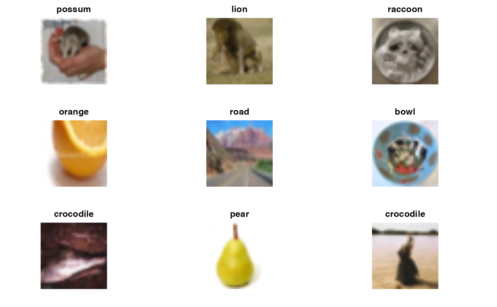
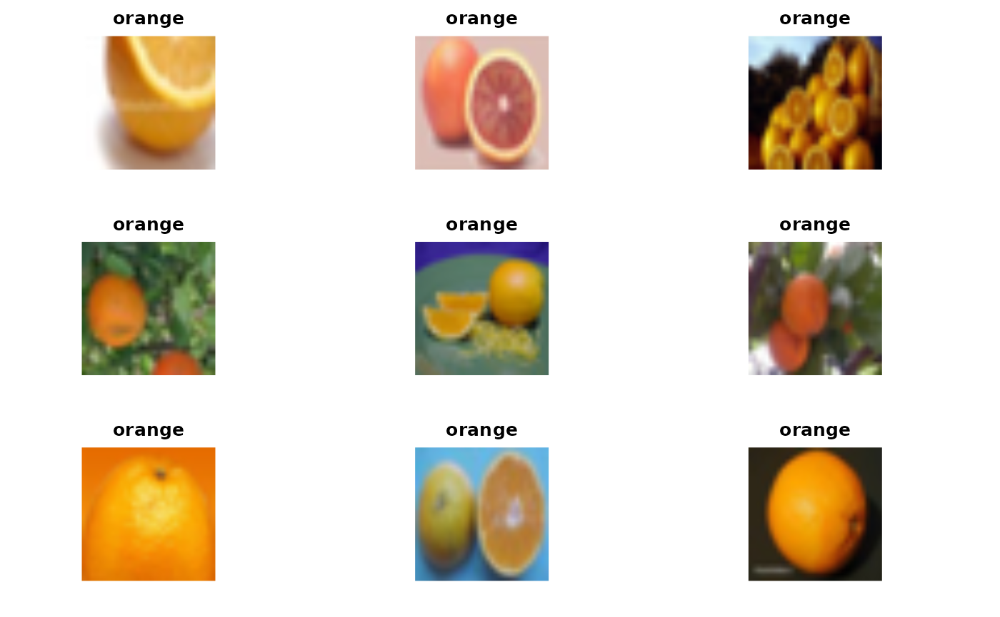

<div id="main" class="col-md-9" role="main">

# S7 Neural net concepts and applications

<div class="section level2">

## Introductory remarks

-   learning a nonlinear regression model and putting it to use
-   “layers” of a multilayer neural net and their correspondence to
    patient characteristics (molecular, clinical) and treatment outcomes
    -   input, output, loss function
-   [excellent high level
    overview](https://stats.stackexchange.com/questions/114385/what-is-the-difference-between-convolutional-neural-networks-restricted-boltzma)
    comparing convolutional neural nets and autoencoders

</div>

<div class="section level2">

## Road map

-   ImageArray

-   [ISLR](https://hastie.su.domains/ISLR2/ISLRv2_corrected_June_2023.pdf)
    (also a [python
    version](https://hastie.su.domains/ISLP/ISLP_website.pdf)
    Convolutional Neural Net example (also see [Jeremy
    Jordan](https://www.jeremyjordan.me/convolutional-neural-networks/)

-   Sfaira model zoo of embeddings and classifiers

</div>

<div class="section level2">

## Images and categories

<div id="cb1" class="sourceCode">

``` r
library(littleDeep)
data(ciftrain1k)
ciftrain1k
```

</div>

    ## ImageArray instance with 1000 images, each 32 x 32 x 3
    ##  Image types: possum lion ... caterpillar girl 
    ##  Array elements range from 0.000000 to 255.000000.

<div id="cb3" class="sourceCode">

``` r
n <- preview(ciftrain1k)
```

</div>



We can filter an ImageArray

<div id="cb4" class="sourceCode">

``` r
preview(filterByType(ciftrain1k, "orange"))
```

</div>



    ## NULL

Question on bias: Does the machine recognize the orange or just the
“more orange” color distribution? How do you “normalize” images so that
the “object itself” presents only the “essential features”?

</div>

<div class="section level2">

## A trained classifier that ingests JPGs as arrays and returns scores for resemblance to

pre-trained categories

Check
[here](https://vjcitn.github.io/littleDeep/articles/A1_three_cl.html)

I’ll demonstrate ‘jpeg\_shrinker’ which could be installed on intel macs
but not on M1 macs at this time. This program will convert a jpeg image
to 32x32 resolution and use a trained CNN to classify the content.

<div id="cb6" class="sourceCode">

``` r
islr_cnn
```

</div>

    ## function (iarr, nEpochs = 30, batchSize = 128, valSplit = 0.2) 
    ## {
    ##     reticulate::import("keras3")
    ##     ca = match.call()
    ##     stopifnot(inherits(iarr, "ImageArray"))
    ##     arr = getArray(iarr)
    ##     d = dim(arr)[-1]
    ##     stopifnot(all(d == c(32, 32, 3)))
    ##     denom = max(arr)
    ##     yclass = getTypes(iarr)
    ##     yclass = as.numeric(factor(yclass))
    ##     yclass = yclass - min(yclass)
    ##     trainxy = list(train = list(x = arr, y = yclass))
    ##     ncat = length(unique(trainxy$train$y))
    ##     model <- keras_model_sequential() %>% layer_conv_2d(filters = 32, 
    ##         kernel_size = c(3, 3), padding = "same", activation = "relu", 
    ##         input_shape = c(32, 32, 3)) %>% layer_max_pooling_2d(pool_size = c(2, 
    ##         2)) %>% layer_conv_2d(filters = 64, kernel_size = c(3, 
    ##         3), padding = "same", activation = "relu") %>% layer_max_pooling_2d(pool_size = c(2, 
    ##         2)) %>% layer_conv_2d(filters = 128, kernel_size = c(3, 
    ##         3), padding = "same", activation = "relu") %>% layer_max_pooling_2d(pool_size = c(2, 
    ##         2)) %>% layer_conv_2d(filters = 256, kernel_size = c(3, 
    ##         3), padding = "same", activation = "relu") %>% layer_max_pooling_2d(pool_size = c(2, 
    ##         2)) %>% layer_flatten() %>% layer_dropout(rate = 0.5) %>% 
    ##         layer_dense(units = 512, activation = "relu") %>% layer_dense(units = ncat, 
    ##         activation = "softmax")
    ##     model %>% compile(loss = "categorical_crossentropy", optimizer = optimizer_rmsprop(), 
    ##         metrics = c("accuracy"))
    ##     history <- model %>% fit(trainxy$train$x/denom, to_categorical(trainxy$train$y, 
    ##         ncat), epochs = nEpochs, batch_size = batchSize, validation_split = valSplit)
    ##     curver = packageVersion("littleDeep")
    ##     ans = list(model = model, history = history, typelevels = typelevels(iarr), 
    ##         littleDeepVersion = curver, call = ca, date = Sys.Date())
    ##     class(ans) = c("islr_cnn", "list")
    ##     ans
    ## }
    ## <bytecode: 0x115f432a8>
    ## <environment: namespace:littleDeep>

</div>

<div class="section level2">

## Sfaira: a model zoo of pretrained embedders and cell-type classifiers from Theis Lab

We’ll look at [the pkgdown site](https://vjcitn.github.io/BiocSfaira),
specifically “get started” tab.

</div>

</div>
