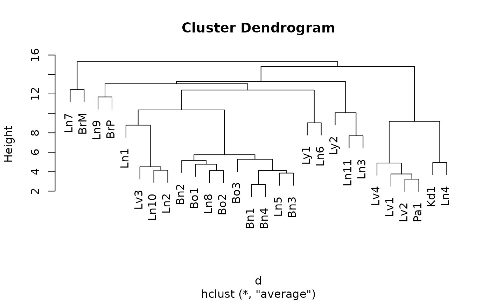
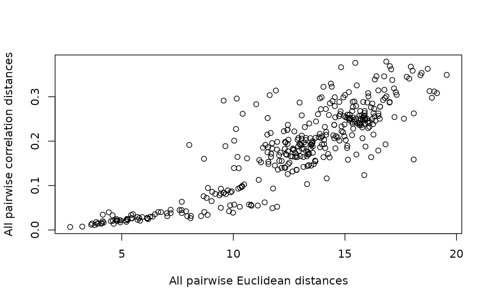
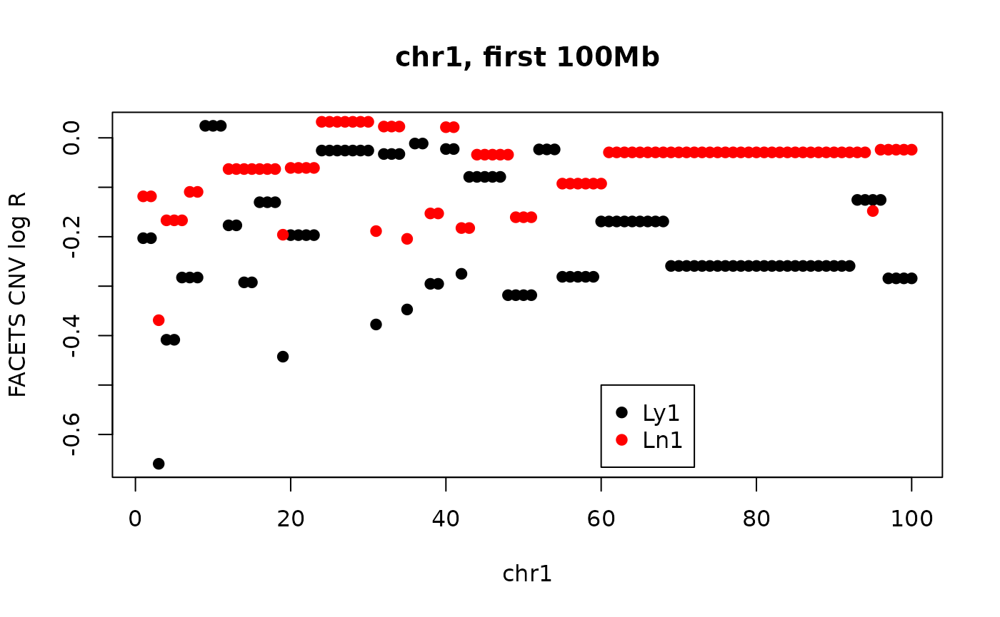
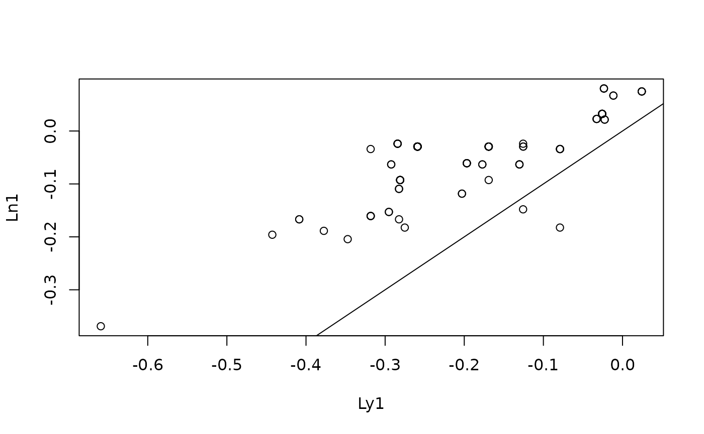
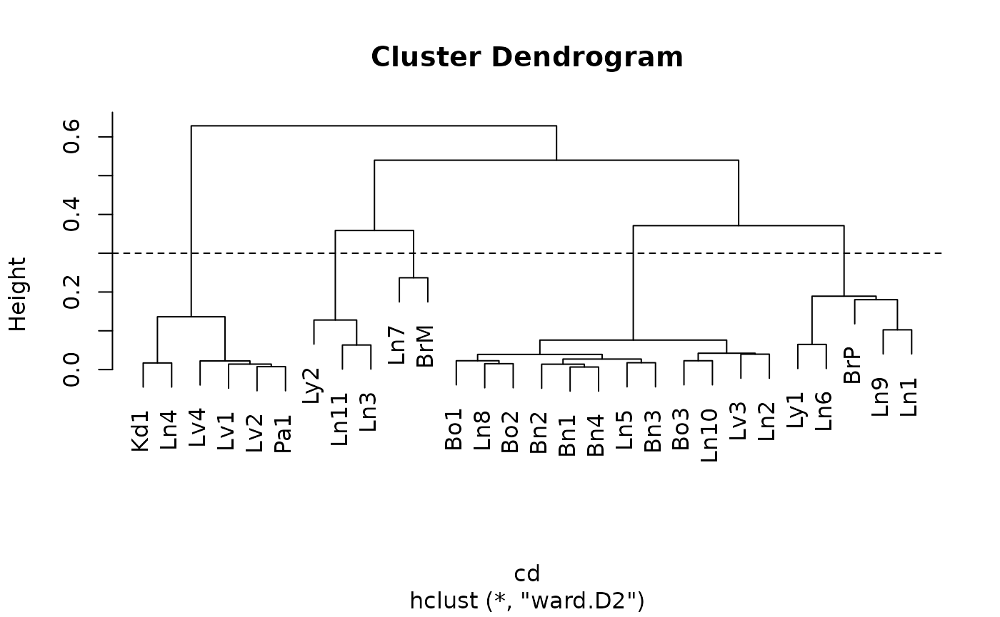
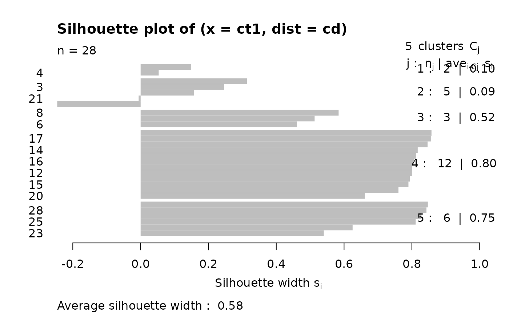
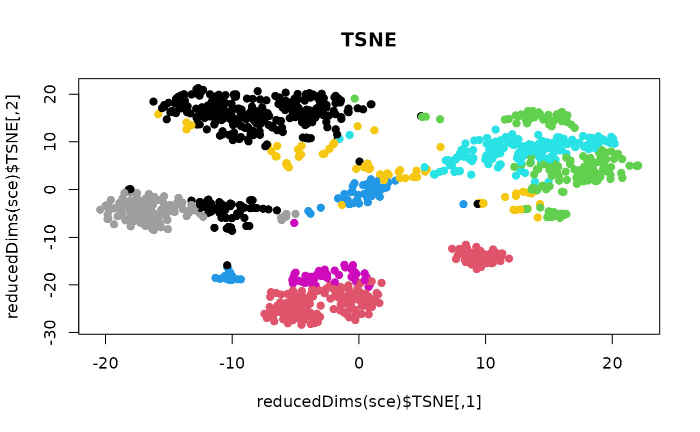
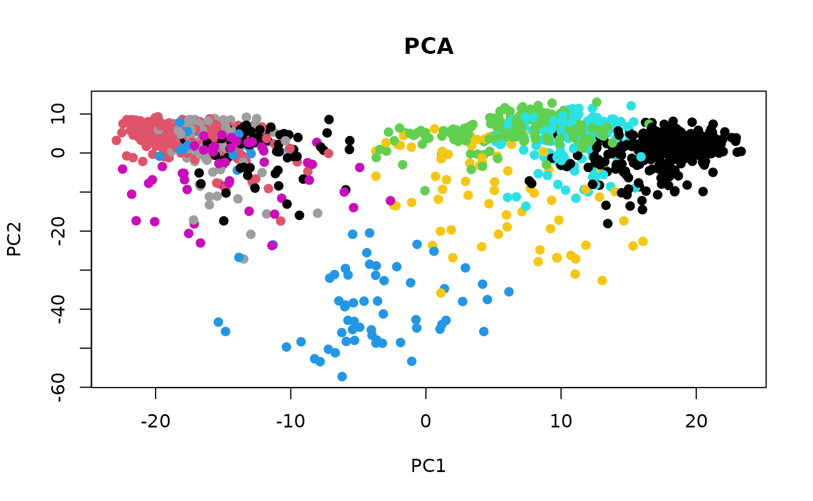
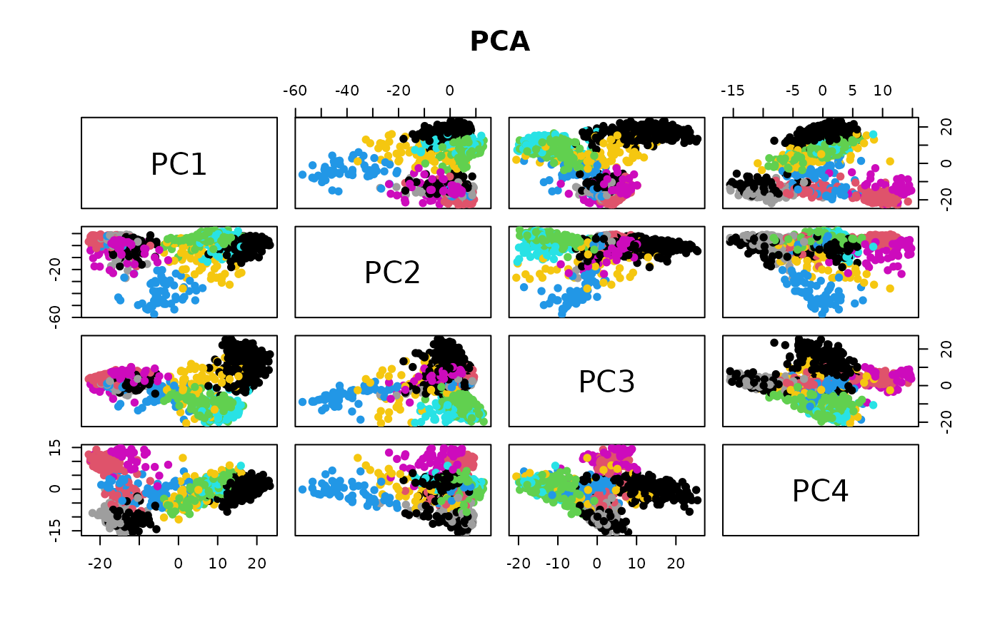
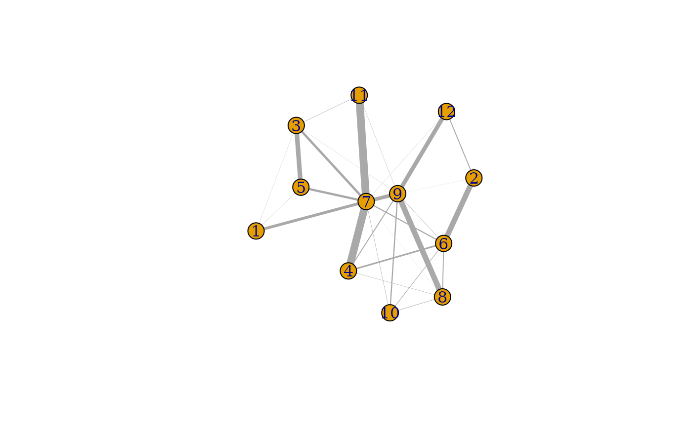

<div id="main" class="col-md-9" role="main">

# distances, nearest-neighbor graphs, clustering

<div id="road-map" class="section level1">

# Road map

-   Concepts underlying cluster analysis
    -   Distances in high-dimensional spaces
    -   Criteria for agglomerative clustering
-   Exploring a cluster analysis of copy-number aberration measures in
    28 tumors from one patient
    -   interactive heatmap
    -   comparing Euclidean and correlation (1-cor) distances
    -   comparing agglomeration methods
    -   the silhouette as a measure of clustering adequacy
    -   the bluster tools for cluster diagnostics
-   bluster applied to scRNA-seq
    -   Grun pancreas data
    -   NNGraphParam

</div>

<div id="cluster-analysis-concepts" class="section level1">

# Cluster analysis concepts

The need to identify groups of similar observations arises in many
contexts – ultimately in the service of clarifying sources of
variability, building power for statistical comparisons.

Hierarchical clustering of N multivariate observations is conducted by
starting with N clusters and proceeding from M clusters to M-1 (M=N, …,
2) clusters by merging the two members separated by the least of all
pairwise distances.


<div id="distances-in-high-dimensional-space" class="section level2">

## Distances in high-dimensional space


</div>

<div id="criteria-for-agglomerative-clustering" class="section level2">

## Criteria for agglomerative clustering


</div>

</div>

<div
id="application-inferring-steps-in-tumor-metastasis-in-a-breast-cancer-patient"
class="section level1">

# Application: inferring steps in tumor metastasis in a breast cancer patient

We’ll examine data distributed with a [2021 Genome Biology
paper](https://genomemedicine.biomedcentral.com/articles/10.1186/s13073-021-00989-6)
from the Gabor Marth lab.

<div class="figure">


Clinical sequence of interventions.

</div>

<div class="figure">


Event sequence.

</div>

<div id="a-view-of-copy-number-aberrations-for-1mb-tiling"
class="section level2">

## A view of copy number aberrations for 1Mb tiling

28 tumors were sampled and sequenced in a rapid autopsy procedure. Copy
number variation was assessed using
[FACETS](https://www.ncbi.nlm.nih.gov/pmc/articles/PMC5027494/).

The tissues from which tumors were taken are Br (Breast), Bo (Bone), Bn
(Brain), Ln (Lung), Lv (Liver), Pa (Pancreas), Ly (Lymph nodes), Kd
(Kidney)

[A plotly-based visualization](cnv-heatmap.md)

The (vertical) ordering of tissues is chosen to exemplify certain
similarities.

For example the block of blue on chr10 is seen for only three samples.
This is an indication of a deletion.

</div>

<div id="a-cluster-analysis-proposed-in-support-of-the-evolutionary-map"
class="section level2">

## A cluster analysis proposed in support of the evolutionary map

This code is lightly modified from a script distributed at
<https://github.com/xiaomengh/tumor-evo-rapid-autopsy.git>.

<div id="cb1" class="sourceCode">

``` r
suppressPackageStartupMessages({
 library(csamaDist)
 library(bioDist)
 library(bluster)
 library(cluster)
 library(scater)
 library(scran)
 library(scRNAseq)
 library(scuttle)
})
data(cnv_log_R)
data = cnv_log_R
samples = c('Ln7','Ln9','Ln1','BrM','BrP',
           'Ln11','Ly2','Ln3',
           'Bo3','Ln10','Bo1','Ln8','Lv3','Ln5','Bo2','Bn2','Bn1','Bn3','Bn4','Ln2',
           'Ly1','Ln6',
           'Kd1','Ln4','Lv4','Lv2','Lv1','Pa1')
rownames(data) = samples
d = dist(data, method="euclidean")
fit = hclust(d, method="average")
# the following line changes the order of the samples to produce the Fig.S3B but doesn't change the phylogenetic relationship
fit$order = c(1,4,2,5,3,13,10,20,16,11,12,15,9,17,19,14,18,21,22,7,6,8,25,27,26,28,23,24)
plot(fit)
```

</div>



</div>

<div id="drilling-down-on-the-clustering" class="section level2">

## Drilling down on the clustering

<div id="comparing-euclidean-and-correlation-distances"
class="section level3">

### Comparing Euclidean and Correlation distances

<div id="cb2" class="sourceCode">

``` r
cd = cor.dist(cnv_log_R) # from bioDist
ed = dist(cnv_log_R)
plot(as.numeric(ed), as.numeric(cd), xlab="All pairwise Euclidean distances", ylab="All pairwise correlation distances")
```

</div>



For a given correlation distance value, there can be wide variation in
euclidean distance, and vice versa.

Open question: What distance metric is most relevant for biological
interpretation of CNV?

</div>

<div
id="a-pair-with-discrepant-correlation-and-euclidean-distance-values-over-entire-genome"
class="section level3">

### A pair with discrepant correlation and euclidean distance values (over entire genome)

We’ll have a look at the first 100Mb on chr1.

<div id="cb3" class="sourceCode">

``` r
plot(cnv_log_R["Ly1",1:100],pch=19, main="chr1, first 100Mb", ylab="FACETS CNV log R", xlab="chr1")
points(cnv_log_R["Ln1",1:100], col="red",pch=19)
legend(60, -.5, pch=19, col=c("black", "red"), legend=c("Ly1", "Ln1"))
```

</div>



<div id="cb4" class="sourceCode">

``` r
#cor(cnv_log_R["Ly1", 1:100], cnv_log_R["Ln1", 1:100])
edist = function(x,y) sqrt(sum((x-y)^2))
edist(cnv_log_R["Ly1", 1:100], cnv_log_R["Ln1", 1:100])
```

</div>

    ## [1] 1.685992

<div id="cb6" class="sourceCode">

``` r
plot(jitter(cnv_log_R["Ly1", 1:100]), cnv_log_R["Ln1", 1:100], xlab="Ly1", ylab="Ln1")
abline(0,1)
```

</div>



</div>

<div
id="redo-clustering-with-alternative-distance-and-agglomeration-method"
class="section level3">

### Redo clustering with alternative distance and agglomeration method

<div id="cb7" class="sourceCode">

``` r
fit2 = hclust(cd, method="ward.D2")
plot(fit2)
abline(h=.3, lty=2)
```

</div>



</div>

<div id="silhouette-measure" class="section level3">

### Silhouette measure

From ?silhouette with the cluster library:

    For each observation i, the _silhouette width_ s(i) is defined as follows:

         Put a(i) = average dissimilarity between i and all other points of
         the cluster to which i belongs (if i is the _only_ observation in
         its cluster, s(i) := 0 without further calculations).  For all
         _other_ clusters C, put d(i,C) = average dissimilarity of i to all
         observations of C.  The smallest of these d(i,C) is b(i) := \min_C
         d(i,C), and can be seen as the dissimilarity between i and its
         "neighbor" cluster, i.e., the nearest one to which it does _not_
         belong.  Finally,

                       s(i) := ( b(i) - a(i) ) / max( a(i), b(i) ).         
         
         'silhouette.default()' is now based on C code donated by Romain
         Francois (the R version being still available as
         'cluster:::silhouette.default.R').

         Observations with a large s(i) (almost 1) are very well clustered,
         a small s(i) (around 0) means that the observation lies between
         two clusters, and observations with a negative s(i) are probably
         placed in the wrong cluster.

<div id="cb9" class="sourceCode">

``` r
ct1 = cutree(fit2, h=.3)
c2 = cnv_log_R
rownames(c2) = paste(rownames(c2), as.numeric(ct1))
sil = silhouette(ct1, cd)
plot(sil)
```

</div>



</div>

<div id="exercises" class="section level3">

### Exercises

**1: install bioDist and vjcitn/csamaDist. Use the code:**

<div id="cb10" class="sourceCode">

``` r
library(csamaDist)
data(cnv_log_R)
hc1 = hclust(dist(cnv_log_R[1:8,]))
hc2 = hclust(bioDist::cor.dist(cnv_log_R[1:8,]), method="ward.D2") 
opar = par(no.readonly=TRUE)
par(mfrow=c(1,2), mar=c(4,3,1,1))
plot(hc1, main="Euc, complete")
plot(hc2, main="1-Cor, Ward's D2")
par(opar)
```

</div>

**Comment on the qualitative differences between the clusterings**.

**2: Here is how to produce a report on silhouette measurement for the
second clustering.**

<div id="cb11" class="sourceCode">

``` r
assn =  cutree(hc2, h=.25)
plot(silhouette( assn, bioDist::cor.dist(cnv_log_R[1:8,])))
```

</div>

**Produce a three-cluster partition from `hc1` and obtain the silhouette
display.**

</div>

</div>

</div>

<div id="clustering-single-cell-rna-seq" class="section level1">

# Clustering single cell RNA-seq

This code is taken verbatim from the bluster “diagnostics” vignette.

<div id="acquire-grun-et-als-single-cell-rna-seq-dataset"
class="section level2">

## Acquire Grun et al’s single cell RNA-seq dataset

\[Grun 2016\]
(<https://www.sciencedirect.com/science/article/pii/S1934590916300947>)
define an algorithm, StemID, that infers candidate multipotent cell
populations in the human pancreas.

<div id="cb12" class="sourceCode">

``` r
library(scRNAseq)
sce <- GrunPancreasData()
```

</div>

    ## snapshotDate(): 2022-04-26

    ## see ?scRNAseq and browseVignettes('scRNAseq') for documentation

    ## loading from cache

    ## snapshotDate(): 2022-04-26

    ## see ?scRNAseq and browseVignettes('scRNAseq') for documentation

    ## loading from cache

<div id="cb19" class="sourceCode">

``` r
# Quality control to remove bad cells.
library(scuttle)
qcstats <- perCellQCMetrics(sce)
qcfilter <- quickPerCellQC(qcstats, sub.fields="altexps_ERCC_percent")
```

</div>

    ## Warning in .get_med_and_mad(metric, batch = batch, subset = subset,
    ## share.medians = share.medians, : missing values ignored during outlier detection

<div id="cb21" class="sourceCode">

``` r
sce <- sce[,!qcfilter$discard]

# Normalization by library size.
sce <- logNormCounts(sce)

# Feature selection.
library(scran)
dec <- modelGeneVar(sce)
hvgs <- getTopHVGs(dec, n=1000)

# Dimensionality reduction.
set.seed(1000)
library(scater)
sce <- runPCA(sce, ncomponents=20, subset_row=hvgs)
sce <- runTSNE(sce, subset_row=hvgs)
```

</div>

</div>

<div
id="clustering-using-a-nearest-neighbor-graph-visualization-via-tsne-and-pca"
class="section level2">

## Clustering using a nearest-neighbor graph; visualization via TSNE and PCA

From bluster’s makeSNNGraph help page

       The 'makeSNNGraph' function builds a shared nearest-neighbour
       graph using observations as nodes. For each observation, its 'k'
       nearest neighbours are identified using the 'findKNN' function,
       based on distances between their expression profiles (Euclidean by
       default). An edge is drawn between all pairs of observations that
       share at least one neighbour, weighted by the characteristics of
       the shared nearest neighbors - see "Weighting Schemes" below.

       The aim is to use the SNN graph to perform clustering of
       observations via community detection algorithms in the 'igraph'
       package. This is faster and more memory efficient than
       hierarchical clustering for large numbers of observations. In
       particular, it avoids the need to construct a distance matrix for
       all pairs of observations. Only the identities of nearest
       neighbours are required, which can be obtained quickly with
       methods in the 'BiocNeighbors' package.

<div id="cb23" class="sourceCode">

``` r
library(bluster)
mat <- reducedDim(sce)
clust.info <- clusterRows(mat, NNGraphParam(), full=TRUE)
clusters <- clust.info$clusters
table(clusters)
```

</div>

    ## clusters
    ##   1   2   3   4   5   6   7   8   9  10  11  12 
    ## 285 171 161  59 174  49  70 137  69  65  28  23

<div id="cb25" class="sourceCode">

``` r
plot(reducedDims(sce)$TSNE, col=clusters, pch=19, main="TSNE")
```

</div>



<div id="cb26" class="sourceCode">

``` r
plot(reducedDims(sce)$PCA, col=clusters, pch=19, main="PCA")
```

</div>



<div id="cb27" class="sourceCode">

``` r
pairs(reducedDims(sce)$PCA[,1:4], col=clusters, pch=19, main="PCA")
```

</div>



</div>

<div id="assessment-via-pairwisemodularity" class="section level2">

## Assessment via pairwiseModularity

<div id="cb28" class="sourceCode">

``` r
g <- clust.info$objects$graph
ratio <- pairwiseModularity(g, clusters, as.ratio=TRUE)

cluster.gr <- igraph::graph_from_adjacency_matrix(log2(ratio+1), 
    mode="upper", weighted=TRUE, diag=FALSE)

# Increasing the weight to increase the visibility of the lines.
set.seed(1100101)
plot(cluster.gr, edge.width=igraph::E(cluster.gr)$weight*5,
    layout=igraph::layout_with_lgl)
```

</div>



</div>

</div>

</div>
