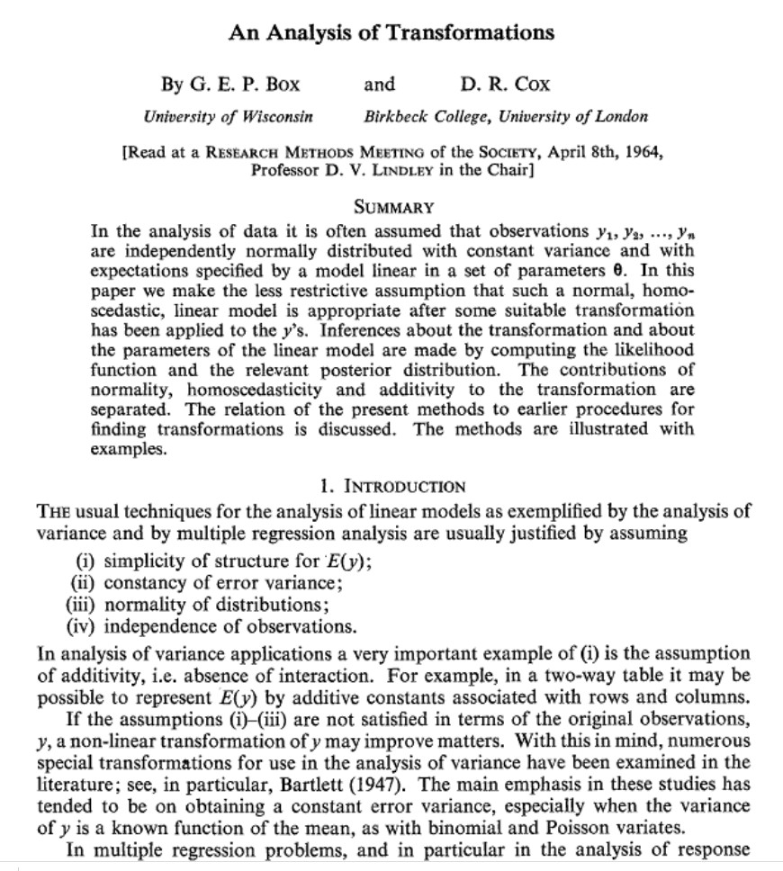

```{r dosetup, echo=FALSE}
suppressPackageStartupMessages({
suppressMessages({
library(CSHstats)
library(MASS)
library(DT)
library(tidyverse)
})
})
```

# EDA: Exploratory data analysis

The field of EDA has changed, thanks to advances in computational
and visualization technology.  Classical EDA addressed

- Assessing distributional shape

- Comparing batches of numbers: Boxplots and beyond

- Transformations; handling "outliers"

More recently, we can consider exploratory data activities that use

- interactive tables

- interactive graphics

- purpose-built graphical user interfaces

We will explore all of these concerns.  Our principles include

- always be prepared to "look at the data"
    - when very high volumes are involved, sampling and dimension reduction
are relevant

- every facet of your data should be accessible to exploration and summarization

# Learning objectives

- Know and propagate knowledge of Anscombe's quartet
    - simple statistics may fail to disclose structure
    - visualization should always be conducted
- Many exploratory tools are tunable and the tuning affects interpretation
    - understand how you might use shiny to explore tunable data visualization
- Data transformations can be useful for allowing the use of classical methods
    - The Box-Cox transformation family provides clues for choosing a transformation
- QQplots help us reason about the suitability of reference distributions
    - We only look at qqnorm, but qqplot allows more general comparisons
- Shiny + TnT allow exploration of data in the context of linear genome annotation


# Anscombe's quartet: statistics that miss the point

In 1973 Francis Anscombe constructed four bivariate
datasets.  The four datasets
of interest are the pairs of columns (x1, y1), (x2, y2), ....

```{r lkans}
library(DT)
datatable(anscombe)
```

In our discussion of probability we provided definitions of
mean, variance, covariance, correlation.  Here is a quick check
on the means of the variables in the quartet.  

- We use the `apply` function which has general arguments
```
apply(X, MARGIN, FUN, ..., simplify=TRUE)
```
where `X` is some array-like entity, `MARGIN` defines
the dimension along with `FUN` will be computed
with additional arguments possibly provided in `...`.

- When `MARGIN` is 1, `FUN` is computed on each "row",
when `MARGIN` is 2, `FUN` is computed on each "column".

- We also introduce a helper function `rounded_stat` which
rounds the result of a univariate statistic.

```{r lkmn, eval=FALSE, echo=FALSE}
vapply(paste0("x", 1:4), function(z) mean(anscombe[[z]]), numeric(1))
```

```{r lkmn2}
rounded_stat = function(x, stat=mean, ndig=2) round(stat(x), ndig)
apply(anscombe, 2, rounded_stat, stat=mean)
apply(anscombe, 2, rounded_stat, stat=sd)
```

This code demonstrates that the x and y variables have identical means
and standard deviations.

Nevertheless, when the variables are plotted against one another, we have:

```{r lkda, echo=FALSE}
     ff = y~x   # from ?anscombe
     mods <- setNames(as.list(1:4), paste0("lm", 1:4))
     for(i in 1:4) {
       ff[2:3] <- lapply(paste0(c("y","x"), i), as.name)
       ## or   ff[[2]] <- as.name(paste0("y", i))
       ##      ff[[3]] <- as.name(paste0("x", i))
       mods[[i]] <- lmi <- lm(ff, data = anscombe)
       }
     op <- par(mfrow = c(2, 2), mar = 0.1+c(4,4,1,1), oma =  c(0, 0, 2, 0))
     for(i in 1:4) {
       ff[2:3] <- lapply(paste0(c("y","x"), i), as.name)
       plot(ff, data = anscombe, col = "red", pch = 21, bg = "orange", cex = 1.2,
            xlim = c(3, 19), ylim = c(3, 13))
       abline(mods[[i]], col = "blue")
     }
     mtext("Anscombe's 4 Regression data sets", outer = TRUE, cex = 1.5)
     par(op)
```

### Exercises

**1. Show that the four correlation coefficients for (x1, y1), ..., (x4, y4)
are identical (up to rounding).**

**2. This [blog post](https://www.njtierney.com/post/2020/06/01/tidy-anscombe/) 
addresses the tidyverse approach to handling the data.
Read the blog post and try to get comfortable with the various steps
towards producing and using a "tidy" representation.**

```{r doansc}
# use BiocManager::install("tidyverse") if necessary
library(tidyverse)
tidy_anscombe <- anscombe %>%
 pivot_longer(cols = everything(),
              names_to = c(".value", "set"),
              names_pattern = "(.)(.)")
library(ggplot2)
ggplot(tidy_anscombe,
       aes(x = x,
           y = y)) +
  geom_point() + 
  facet_wrap(~set) +
  geom_smooth(method = "lm", se = FALSE)
```


# Exploring distributional shape

## Univariate

The mode of a distribution is the "most common value".  The peak
of a histogram would correspond to the mode of the corresponding
distribution for a discrete random variable.  For continuous
random variables, the mode is given by the peak of the density function.

A basic question about a univariate dataset is: Could it have
a multimodal distribution?

**Live Exercise: programming interactive exploration.**

**Use R studio's File control to produce
a new "Shiny app", and give it the name "modality".  Then use "Run app"
control.**

**The slider controls the number of bins used to summarize the values
of times of geyser eruption.  How many modes might the underlying
distribution have?**

## Transformation


To search for a transformation that best symmetrizes a skewed distribution,
the `boxcox` function from the MASS library can be used.
The origins of the procedure were reported to the Royal Statistical
Society in 1964.



The basic idea is that we can construct a series of functional
transformations of a random variable to produce a distribution
(on the transformed scale) that is approximately normal.  The
Box-Cox family of transformations is indexed by a single parameter,
$\lambda$. The transformation of the variable $y$ to
$y^*(\lambda) = \lambda^{-1}(y^\lambda-1)$ (if $\lambda \neq 0$) and
log $y$ if $\lambda = 0$ provides a smooth
traversal of (fractional) power, logarithm, and reciprocal power
operations on $y$.  If $\lambda$ is 1, no transformation is indicated.

```{r doboxc}
opar = par(no.readonly=TRUE)
par(mfrow=c(2,2), mar=c(3,2,1,1))
data(fos_ex)
hist(fos_ex, main="raw")
hist(sqrt(fos_ex), main="sqrt")
hist(fos_ex^2, main="square")
hist(log(fos_ex), main="log")
par(opar)
```

The boxcox function in the MASS library will trace the likelihood
function that is maximized when the distribution of $y^*(\lambda)$ is
as close to Gaussian as possible.

```{r doboco}
library(MASS)
boxcox(fos_ex~1) # must use formula
```

### Exercise

**3. What transformation does boxcox() recommend when applied to `log(egr1_ex)`?**

**4. What transformation does boxcox() recommend when applied to the geyser data
that we started out with?**

## Is it Gaussian?

The concept of the Q-Q plot (quantile-quantile plot) is used to
compare a given data vector to a reference distribution (or to
the distribution of some other data vector).

```{r lkqqp}
qqnorm(fos_ex, main="Compare FOS to Gaussian distribution")
```

If the configuration of points in the Q-Q plot does not
form a straight line, the reference distribution is probably
not appropriate.

### Exercises

**5. Use qqnorm with the log(fos_ex) and comment.**

**6. `zsc = function(x) (x - mean(x))/sd(x)`.  What is special
about `qqnorm(zsc(log(fos_ex)))`?**


## Bivariate

We can use density estimation in the plane to reason about
multimodality in bivariate data.  This is from `example(geom_density_2d)`:

```{r dobiv}
library(datasets)
data(faithful)
m <- ggplot(faithful, aes(x = eruptions, y = waiting)) +
  geom_point() + xlim(0.5, 6) + ylim(40, 110)
# contour lines
m + geom_density_2d()
```

### Exercise

**7. Comment on the meaning of "local modes" in these "marginal" displays.**

```{r lksmoo}
opar = par(no.readonly=TRUE)
par(mfrow=c(1,2), mar=c(3,2,1,1))
plot(density(faithful$erup, .08))
plot(density(faithful$wait, 1.4))
par(opar)
```

### Exercise

**8. (advanced): Produce a shiny app that has a controller for the
bandwidth of the density estimator for viewing the 
bivariate structure of the `faithful` data.**
```

# Visualizing data in the context of the genome

We will use `https://vjcitn.shinyapps.io/tnt4dn8` to look at
GWAS and eQTL data jointly.
